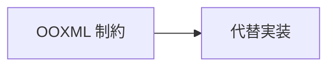

# Mermaid → PPTX 変換: 未対応ダイアグラムと OOXML 制約まとめ

## 1. ダイアグラム対応状況一覧

| ダイアグラム | 対応状況 | 実装方式 |
|---|---|---|
| `flowchart` / `graph` | ✅ 対応 | mermaid-parser-py 経由 |
| `sequenceDiagram` | ✅ 対応 | mermaid-parser-py 経由 |
| `classDiagram` | ✅ 対応 | mermaid-parser-py 経由 |
| `stateDiagram` / `stateDiagram-v2` | ✅ 対応 | mermaid-parser-py 経由 |
| `erDiagram` | ✅ 対応 | mermaid-parser-py 経由 |
| `mindmap` | ✅ 対応 | mermaid-parser-py 経由 |
| `pie` | ✅ 対応 | カスタムパーサー |
| `journey` | ✅ 対応 | カスタムパーサー |
| `gantt` | ✅ 対応 | カスタムパーサー |
| `quadrantChart` | ✅ 対応 | カスタムパーサー |
| `requirementDiagram` | ✅ 対応 | カスタムパーサー |
| `gitGraph` | ✅ 対応 | カスタムパーサー |
| `timeline` | ✅ 対応 | カスタムパーサー |
| `zenuml` | ❌ 未対応 | フォールバック（ソースコードをテキスト表示） |
| `sankey-beta` | ❌ 未対応 | フォールバック（ソースコードをテキスト表示） |
| `xychart-beta` | ❌ 未対応 | フォールバック（ソースコードをテキスト表示） |
| `block-beta` | ❌ 未対応 | フォールバック（ソースコードをテキスト表示） |
| `packet-beta` | ❌ 未対応 | フォールバック（ソースコードをテキスト表示） |
| `kanban` | ❌ 未対応 | フォールバック（ソースコードをテキスト表示） |
| `architecture-beta` | ❌ 未対応 | フォールバック（ソースコードをテキスト表示） |
| `C4Context` / `C4Container` / `C4Component` / `C4Dynamic` / `C4Deployment` | ❌ 未対応 | フォールバック（ソースコードをテキスト表示） |

---

## 2. 未対応ダイアグラムの詳細

### 未対応となった理由

| ダイアグラム | 未対応理由 |
|---|---|
| `zenuml` | mermaid-parser-py の JS エンジンが構文を解析できない。`renderer.py` の `_UNSUPPORTED_PREFIXES` で明示的に早期フォールバック |
| `sankey-beta` / `xychart-beta` / `block-beta` / `packet-beta` | mermaid-parser-py がパース自体は試みるが `graph_data` が空になるか解析エラーとなる |
| `kanban` / `architecture-beta` | mermaid-parser-py が未対応の実験的ダイアグラム。パース失敗でフォールバック |
| C4 系 | Mermaid 独自拡張のため mermaid-parser-py では解析不可 |

### フォールバック動作

未対応ダイアグラムはスライドにテキストボックスとして Mermaid ソースコードをそのまま表示する（`BaseDiagramRenderer._render_fallback()` を使用）。

---

## 3. 対応済みダイアグラムの OOXML 制約と代替案

### 3.1 シーケンス図（`sequenceDiagram`）

| 制約項目 | OOXML 制約の内容 | 代替実装 |
|---|---|---|
| actor 人型シンボル | OOXML プリセットに人型シェープが存在しない | 角丸矩形（`roundRect`）で代替 |
| クロス矢印（`-x`, `--x`） | `headEnd` に `cross` 種別が存在しない | ラベル末尾に「✕」を付加 |
| 非同期矢印（`-)`, `--)` ） | 専用の矢印種別がない | `open` 矢印で代替 |
| Note の折り目（dog-ear） | 複雑なパス形状は OOXML で実装困難 | 単純な黄色矩形 |
| 自己メッセージ | ループコネクターが標準 API にない | ELBOW コネクターで L 字型近似 |
| フレームタブ（五角形） | 五角形の枠形状は標準 API にない | 左上に小矩形タブを別途配置 |

---

### 3.2 状態図（`stateDiagram` / `stateDiagram-v2`）

| 制約項目 | OOXML 制約の内容 | 代替実装 |
|---|---|---|
| 終了状態 bull's-eye | OOXML プリセットに bull's-eye が存在しない | 黒 OVAL + 内側小白 OVAL の 2 図形重ね合わせ |
| 複合状態グループ | python-pptx に GroupShape 管理 API がない | 外枠矩形を先に描画し、子シェープを独立配置（Z オーダー：外枠 → 子） |
| fork/join バー | 横バー専用プリセットが存在しない | 扁平 RECTANGLE（高さ小・幅大・黒塗り）で代替 |
| 並行区画（divider） | 破線枠の設定が標準 API にない | lxml で `<a:prstDash val="dash">` を直接 XML 操作 |

---

### 3.3 ER 図（`erDiagram`）

| 制約項目 | OOXML 制約の内容 | 代替実装 |
|---|---|---|
| カーディナリティ記号（カラス足等） | OOXML コネクター端点でカラス足などを表現できない | コネクター端点近傍にテキストボックスでカーディナリティ文字列を表示 |
| エンティティグループ化 | python-pptx に GroupShape 管理 API がない | lxml で直接 `<p:grpSp>` XML を組み立ててエンティティとカーディナリティラベルをグループ化 |

---

### 3.4 円グラフ（`pie`）

| 制約項目 | OOXML 制約の内容 | 代替実装 |
|---|---|---|
| データラベル位置（`textPosition`） | Mermaid の `textPosition`（0.0〜1.0 の連続値）を OOXML の `dLblPos` 属性（離散値）にマッピングする必要がある | 閾値ベースで `inEnd` / `ctr` / `outEnd` のいずれかに変換し、lxml で `<c:dLblPos>` を直接 XML 操作 |

---

### 3.5 象限チャート（`quadrantChart`）

| 制約項目 | OOXML 制約の内容 | 代替実装 |
|---|---|---|
| Y 軸ラベル縦書き | OOXML テキストフレームの縦書き設定は日本語のみ有効で、英数字は文字が回転しない | テキストボックスを `rotation=270°` で水平回転 |
| 象限背景グラデーション | Mermaid はグラデーション塗りを使用するが python-pptx API での設定が複雑 | 単色矩形のみ（グラデーション未対応） |
| ポイントラベル重なり | ラベル配置の重なり回避ロジックが複雑 | 回避なし（重なりはそのまま表示） |

---

### 3.6 要件図（`requirementDiagram`）

| 制約項目 | OOXML 制約の内容 | 代替実装 |
|---|---|---|
| リレーションラベル（«traces» 等） | コネクターへの中間ラベル設定 API が制限的 | コネクター中点にテキストボックスを別途配置 |
| 点線コネクター | python-pptx 標準 API で破線設定ができない | lxml で `<a:ln>` に `<a:prstDash val="dash">` を直接 XML 操作 |
| Markdown 書式（`**bold**` / `*italic*`） | テキストフレーム全体での書式変更のみ標準 API が提供される | run ごとに書式（太字・斜体）を個別指定 |

---

### 3.7 Git グラフ（`gitGraph`）

| 制約項目 | OOXML 制約の内容 | 代替実装 |
|---|---|---|
| REVERSE コミット（✕マーク） | 特定の形状プリセットが存在しない | 楕円（ブランチ色）+ 白テキスト「✕」オーバーレイ |
| MERGE コミット（二重円） | 二重円プリセットが存在しない | 楕円の上に白い小楕円を重ねる |
| CHERRY_PICK コミット | 専用形状がない | 明るい紫色の楕円で代替 |
| タグの旗型シェープ | OOXML プリセットに旗型が存在しない | 角丸矩形（薄黄背景・細枠線）で代替 |
| マージ接続破線 | python-pptx 標準 API で破線設定ができない | lxml で `<a:prstDash val="dash">` を直接 XML 操作 |

---

### 3.8 タイムライン（`timeline`）

| 制約項目 | OOXML 制約の内容 | 代替実装 |
|---|---|---|
| CSS テーマ変数（`cScale0`〜`cScale11`） | PPTX にテーマ変数の動的参照機能がない | 固定 12 色パレットで近似 |
| `disableMulticolor` オプション | Mermaid CSS 変数の動的制御が PPTX では実行できない | 常にマルチカラー（実用上問題なし） |
| 動的コンテンツ依存列幅 | PPTX 上でのテキスト幅測定 API が標準では利用できない | 均等列幅 |
| SVG 曲線コネクタ | OOXML 標準コネクターは直線・ELBOW のみ | 水平軸ラインのみ表示（曲線コネクタは省略） |

---

### 3.9 フローチャート（`flowchart` / `graph`）

| 制約項目 | OOXML 制約の内容 | 代替実装 |
|---|---|---|
| クロス矢印（`arrow_cross`） | OOXML `headEnd` / `tailEnd` に `cross` 種別がない | 通常矢印（`arrow`）で代替 |
| 逆台形ノード（`inv_trapezoid`） | OOXML 正規プリセット名に `invertedTrapezoid` が存在しない | `trapezoid` プリセットに `flipV="1"` を適用して垂直反転 |

---

### 3.10 制約なし・またはほぼ完全対応のダイアグラム

以下のダイアグラムは mermaid-parser-py が `graph_data` を正しく返し、OOXML 固有の代替実装を必要としない機能で実装されている。

| ダイアグラム | 備考 |
|---|---|
| `classDiagram` | クラス・メソッド・属性・継承・集約・コンポジション・依存を標準 API で描画 |
| `mindmap` | ツリー構造を再帰的に OVAL / 矩形で描画 |
| `journey` | 横軸タスクバーを矩形で描画（カスタムパーサー使用） |
| `gantt` | タスクバーを矩形で描画、ラベルはテキストボックス（カスタムパーサー使用） |

---

## 4. OOXML 直接操作が必要な共通パターン

PPTX の python-pptx ライブラリでは API が提供されていない機能を lxml で直接 OOXML を編集することで実現している。主なパターンを以下にまとめる。

| パターン | 対象属性 / 要素 | 使用箇所 |
|---|---|---|
| 破線コネクター | `<a:ln><a:prstDash val="dash"></a:ln>` | stateDiagram / requirementDiagram / gitGraph |
| グループ化 | `<p:grpSp>` を lxml で直接組み立て | erDiagram / base.py |
| コネクター矢印端点 | `<a:tailEnd>` / `<a:headEnd>` の `type` 属性 | sequenceDiagram / requirementDiagram / flowchart |
| データラベル位置 | `<c:dLblPos val="...">` | pie |
| テキスト透明度 | `<a:alpha val="...">` | sequenceDiagram の Note |
