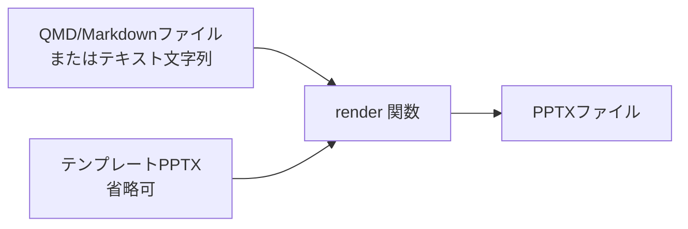
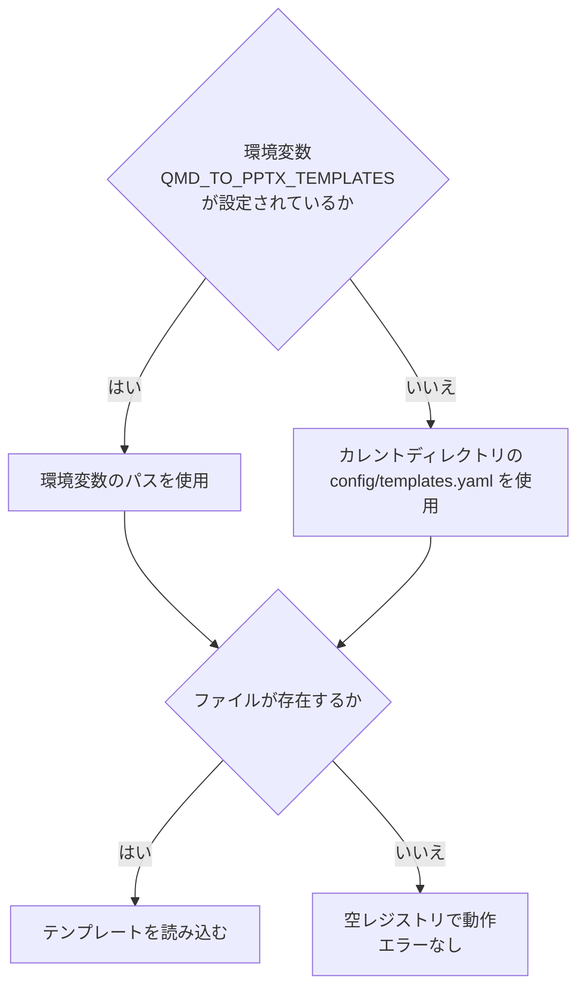

# qmd_to_pptx

QMD（Quarto Markdown）またはMarkdownファイルをPowerPoint（PPTX）に変換するPythonライブラリです。
Pythonライブラリとして直接利用するほか、MCPサーバーとして起動してAIエージェントから呼び出すことも可能です。

---

## 目次

- [インストール](#インストール)
- [対応機能](#対応機能)
- [ライブラリとしての使い方](#ライブラリとしての使い方)
- [MCPサーバーとしての使い方](#mcpサーバーとしての使い方)
- [テンプレート機能](#テンプレート機能)
- [QMD記法リファレンス](#qmd記法リファレンス)

---

## インストール

[uv](https://github.com/astral-sh/uv) を使ってインストールします。

```
uv pip install -e .
```

Python 3.11 以上が必要です。

---

## 対応機能

| 機能 | 記法 |
|------|------|
| スライド分割 | `##` 見出し（H2）または `---` 水平区切り |
| セクションスライド | `#` 見出し（H1） |
| テキスト・段落 | 通常のMarkdown段落 |
| 順序なし・順序付きリスト | `- ` / `1. ` |
| インクリメンタルリスト | `::: {.incremental}` ブロック |
| テーブル | `\| 列1 \| 列2 \|` 形式 |
| コードブロック | バッククォート3つ囲み |
| インライン数式 | `$...$` |
| ブロック数式 | `$$...$$` |
| Mermaid図（標準記法） | ````mermaid` コードブロック |
| Mermaid図（Quartoネイティブ） | ````{mermaid}` コードブロック |
| 2カラムレイアウト | `:::: {.columns}` / `::: {.column}` |
| スピーカーノート | `::: {.notes}` ブロック |
| テンプレート指定 | YAMLフロントマター `reference-doc` フィールド |

---

## ライブラリとしての使い方

### 処理の流れ



### ファイルパスを渡す場合

`render()` 関数の第1引数にファイルパスの文字列を渡すと、そのファイルを読み込んで変換します。

```
from qmd_to_pptx import render

render("slides.qmd", "output.pptx")
```

テンプレートとなるPPTXファイルを指定すると、そのデザイン・テーマを引き継いだスライドを生成します。

```
render("slides.qmd", "output.pptx", reference_doc="template.pptx")
```

### テキスト文字列を渡す場合

第1引数がファイルシステム上に存在しないパスまたは文字列の場合は、その内容をMarkdownテキストとして直接処理します。

```
from qmd_to_pptx import render

markdown_text = """---
title: プレゼンテーション
---

## スライド1

内容テキスト
"""

render(markdown_text, "output.pptx")
```

### render 関数のシグネチャ

| 引数 | 型 | 説明 |
|------|----|------|
| `input` | `str` | QMD/Markdownのファイルパス、またはテキスト文字列 |
| `output` | `str` | 出力先PPTXファイルのパス |
| `reference_doc` | `str \| None` | テンプレートPPTXファイルのパス（省略可） |

`reference_doc` はYAMLフロントマターの `format.pptx.reference-doc` フィールドよりも引数指定が優先されます。

---

## MCPサーバーとしての使い方

### サーバーの起動

MCPサーバーとして起動すると、AIエージェント（Claude Desktopなど）から `markdown_to_pptx` ツールを呼び出してPPTXを生成できます。

**stdioモード（デフォルト）**

```
qmd-to-pptx-mcp
```

または

```
qmd-to-pptx-mcp --transport stdio
```

**HTTPモード**

```
qmd-to-pptx-mcp --transport http --host 0.0.0.0 --port 8000
```

### Claude Desktop への設定

Claude Desktop の設定ファイル（`claude_desktop_config.json`）に以下を追加します。

```json
{
  "mcpServers": {
    "qmd_to_pptx": {
      "command": "qmd-to-pptx-mcp",
      "args": []
    }
  }
}
```

uvを使ってプロジェクトディレクトリから直接起動する場合は下記のように指定します。

```json
{
  "mcpServers": {
    "qmd_to_pptx": {
      "command": "uv",
      "args": ["run", "--directory", "/path/to/qmd_to_pptx", "qmd-to-pptx-mcp"]
    }
  }
}
```

### 公開ツール

MCPサーバーは以下の2つのツールを公開します。

#### `markdown_to_pptx`

| パラメータ | 型 | 説明 |
|------------|----|------|
| `content` | `string` | QMDまたはMarkdownのテキスト文字列（ファイルパスではなくテキスト内容そのもの） |
| `output` | `string` | 出力先PPTXファイルパス（サーバー側ファイルシステム上のパス） |
| `template_id` | `string`（省略可） | `config/templates.yaml` に登録済みのテンプレートID |

成功時は生成されたファイルパスを示す文字列を返します。失敗時はエラー内容を示す文字列を返します。指定した `template_id` が未登録の場合は、利用可能なID一覧を含むエラーメッセージを返します。

#### `list_templates`

パラメータなし。`config/templates.yaml` に登録済みのテンプレートID一覧と説明を返します。テンプレートが登録されていない場合はその旨を示すメッセージを返します。

### 通信フロー


stdioモードでは標準出力はMCPプロトコル通信専用です。ログはすべて標準エラー出力（stderr）に出力されます。

---

## テンプレート機能

事前にPPTXテンプレートを登録しておくと、MCPサーバーの `markdown_to_pptx` ツールでテンプレートIDを指定して変換できます。

### templates.yaml のフォーマット

`config/templates.yaml` に以下の形式でテンプレートを登録します。

```yaml
templates:
  corporate_standard:
    path: /path/to/corporate_standard.pptx
    description: "企業標準テンプレート"
  dark_theme:
    path: /path/to/dark_theme.pptx
    description: "ダークテーマテンプレート"
```

| フィールド | 必須 | 説明 |
|-----------|------|------|
| `templates.<id>.path` | 必須 | PPTXテンプレートファイルの絶対パス |
| `templates.<id>.description` | 任意 | テンプレートの説明文 |

`path` フィールドが存在しないテンプレートエントリは読み込み時にスキップされます。

### 設定ファイルのパス指定

テンプレート設定ファイルのパスは以下の順序で決定されます。



環境変数 `QMD_TO_PPTX_TEMPLATES` にYAMLファイルの絶対パスを指定すると、デフォルトパスの代わりにそのパスが使われます。

### テンプレートの確認方法

MCPツール `list_templates` を呼び出すと、現在の設定ファイルに登録されたテンプレートの一覧を取得できます。

---

## QMD記法リファレンス

### YAMLフロントマター

スライド全体のメタデータと設定をファイル先頭に記述します。

```
---
title: プレゼンテーションタイトル
author: 著者名
date: 2026-03-15
format:
  pptx:
    incremental: false
    reference-doc: template.pptx
---
```

| フィールド | 説明 |
|-----------|------|
| `title` | タイトルスライドに表示するタイトル |
| `author` | タイトルスライドに表示する著者名 |
| `date` | タイトルスライドに表示する日付 |
| `format.pptx.incremental` | `true` のとき全リストをインクリメンタル表示にする |
| `format.pptx.reference-doc` | テンプレートPPTXファイルのパス |

### スライド分割

`##` 見出しがスライドの区切りになります。`---` 水平区切り線はタイトルなしの空白スライドを生成します。`#` 見出しはセクションヘッダースライドとして扱われます。

### 2カラムレイアウト

`:::: {.columns}` ブロック内に `::: {.column}` を2つ並べると左右2カラムのスライドになります。

### スピーカーノート

`::: {.notes}` ブロック内のテキストは発表者ビューのノートとして格納されます。スライド本文には表示されません。

### インクリメンタルリスト

`::: {.incremental}` ブロック内のリストは、PowerPointのアニメーションとして1項目ずつ表示されます。
