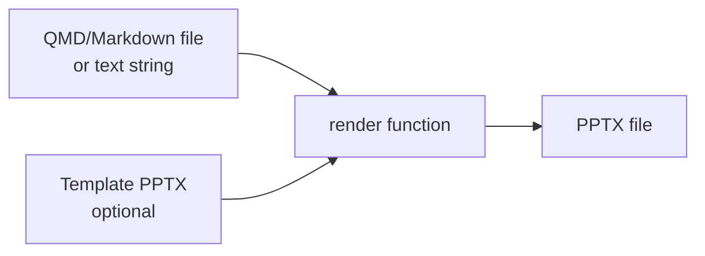
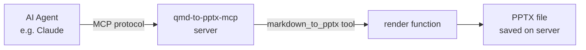
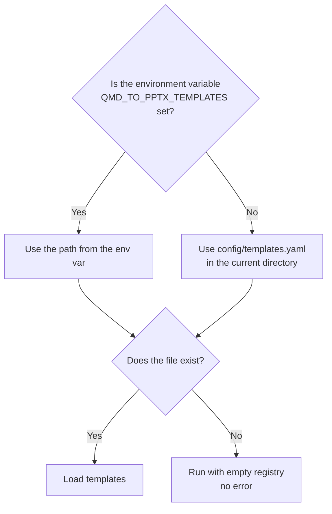

# qmd_to_pptx

A Python library that converts QMD (Quarto Markdown) or Markdown files into **editable** PowerPoint (PPTX) presentations.
It can be used directly as a Python library, or launched as an MCP server to be called from AI agents.

> **日本語版:** [README_ja.md](README_ja.md)

---

## Table of Contents

- [Installation](#installation)
- [Full Feature Demo](#full-feature-demo)
- [Supported Features](#supported-features)
- [Usage as a Library](#usage-as-a-library)
- [Usage as an MCP Server](#usage-as-an-mcp-server)
- [Template Feature](#template-feature)
- [QMD Syntax Reference](#qmd-syntax-reference)

---

## Installation

Install using [uv](https://github.com/astral-sh/uv):

```
uv pip install -e .
```

Python 3.11 or later is required.

---

## Full Feature Demo

`tests/demo_full.qmd` in the repository is a demo file covering all supported features.
Run the following command to generate `demo_full.pptx` and verify the output:

```
uv run python -c "from qmd_to_pptx import render; render('tests/demo_full.qmd', 'demo_full.pptx')"
```

Open `demo_full.pptx` in PowerPoint or a compatible application to review the result.

---

## Supported Features

| Feature | Syntax |
|---------|--------|
| Slide split | `##` heading (H2) or `---` horizontal rule |
| Section slide | `#` heading (H1) |
| Text / paragraphs | Standard Markdown paragraphs |
| Unordered / ordered lists | `- ` / `1. ` |
| Incremental list | `::: {.incremental}` block |
| Table | `\| col1 \| col2 \|` format |
| Code block | Triple backtick fences |
| Inline math | `$...$` |
| Block math | `$$...$$` |
| Mermaid diagram (standard) | ` ```mermaid ` code block |
| Mermaid diagram (Quarto native) | ` ```{mermaid} ` code block |
| Two-column layout | `:::: {.columns}` / `::: {.column}` |
| Speaker notes | `::: {.notes}` block |
| Template specification | YAML front matter `reference-doc` field |

---

## Usage as a Library

### Processing Flow



### Passing a File Path

Pass a file path string as the first argument of `render()` to read and convert that file.

```
from qmd_to_pptx import render

render("slides.qmd", "output.pptx")
```

Specify a template PPTX file to inherit its design and theme:

```
render("slides.qmd", "output.pptx", reference_doc="template.pptx")
```

### Passing a Text String

If the first argument is a string that does not exist as a path on the filesystem, it is processed directly as Markdown text.

```
from qmd_to_pptx import render

markdown_text = """---
title: My Presentation
---

## Slide 1

Content text
"""

render(markdown_text, "output.pptx")
```

### `render` Function Signature

| Argument | Type | Description |
|----------|------|-------------|
| `input` | `str` | File path to a QMD/Markdown file, or a Markdown text string |
| `output` | `str` | Output PPTX file path |
| `reference_doc` | `str \| None` | Path to a template PPTX file (optional) |

When `reference_doc` is provided as an argument, it takes precedence over the `format.pptx.reference-doc` field in the YAML front matter.

---

## Usage as an MCP Server

### Starting the Server

When launched as an MCP server, AI agents (such as Claude Desktop) can call the `markdown_to_pptx` tool to generate PPTX files.

**stdio mode (default)**

```
qmd-to-pptx-mcp
```

or

```
qmd-to-pptx-mcp --transport stdio
```

**HTTP mode**

```
qmd-to-pptx-mcp --transport http --host 0.0.0.0 --port 8000
```

### Claude Desktop Configuration

Add the following to the Claude Desktop configuration file (`claude_desktop_config.json`):

```json
{
  "mcpServers": {
    "qmd_to_pptx": {
      "command": "qmd-to-pptx-mcp",
      "args": []
    }
  }
}
```

To launch directly from the project directory using uv:

```json
{
  "mcpServers": {
    "qmd_to_pptx": {
      "command": "uv",
      "args": ["run", "--directory", "/path/to/qmd_to_pptx", "qmd-to-pptx-mcp"]
    }
  }
}
```

### Exposed Tools

The MCP server exposes the following two tools.

#### `markdown_to_pptx`

| Parameter | Type | Description |
|-----------|------|-------------|
| `content` | `string` | QMD or Markdown text string (the text content itself, not a file path) |
| `output` | `string` | Output PPTX file path (a path on the server-side filesystem) |
| `template_id` | `string` (optional) | A template ID registered in `config/templates.yaml` |

Returns a string indicating the generated file path on success, or an error message on failure. If the specified `template_id` is not registered, an error message listing available IDs is returned.

#### `list_templates`

No parameters. Returns the list of template IDs and descriptions registered in `config/templates.yaml`. If no templates are registered, a message indicating that is returned.

### Communication Flow



In stdio mode, stdout is exclusively used for MCP protocol communication. All logs are written to stderr.

---

## Template Feature

By registering PPTX templates in advance, you can specify a template ID when calling the `markdown_to_pptx` tool via the MCP server.

### `templates.yaml` Format

Register templates in `config/templates.yaml` using the following format:

```yaml
templates:
  corporate_standard:
    path: /path/to/corporate_standard.pptx
    description: "Corporate standard template"
  dark_theme:
    path: /path/to/dark_theme.pptx
    description: "Dark theme template"
```

| Field | Required | Description |
|-------|----------|-------------|
| `templates.<id>.path` | Required | Absolute path to the PPTX template file |
| `templates.<id>.description` | Optional | Description of the template |

Template entries that do not have a `path` field are skipped when loading.

### Configuration File Path Resolution

The template configuration file path is resolved in the following order:



Setting the `QMD_TO_PPTX_TEMPLATES` environment variable to the absolute path of a YAML file will use that path instead of the default.

### Checking Registered Templates

Call the MCP tool `list_templates` to retrieve the list of templates currently registered in the configuration file.

---

## QMD Syntax Reference

### YAML Front Matter

Write the metadata and settings for the entire presentation at the top of the file.

```
---
title: My Presentation Title
author: Author Name
date: 2026-03-15
format:
  pptx:
    incremental: false
    reference-doc: template.pptx
---
```

| Field | Description |
|-------|-------------|
| `title` | Title displayed on the title slide |
| `author` | Author name displayed on the title slide |
| `date` | Date displayed on the title slide |
| `format.pptx.incremental` | When `true`, all lists are displayed incrementally |
| `format.pptx.reference-doc` | Path to the template PPTX file |

### Slide Splitting

`##` headings act as slide separators. A `---` horizontal rule generates a blank slide with no title. `#` headings are treated as section header slides.

### Two-Column Layout

Placing two `::: {.column}` blocks inside a `:::: {.columns}` block creates a two-column slide layout.

### Speaker Notes

Text inside a `::: {.notes}` block is stored as presenter notes in the speaker view. It is not displayed on the slide itself.

### Incremental Lists

Lists inside a `::: {.incremental}` block are displayed as PowerPoint animations, one item at a time.
