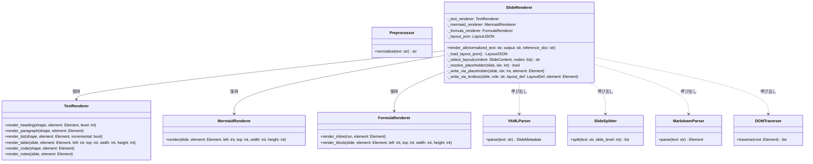
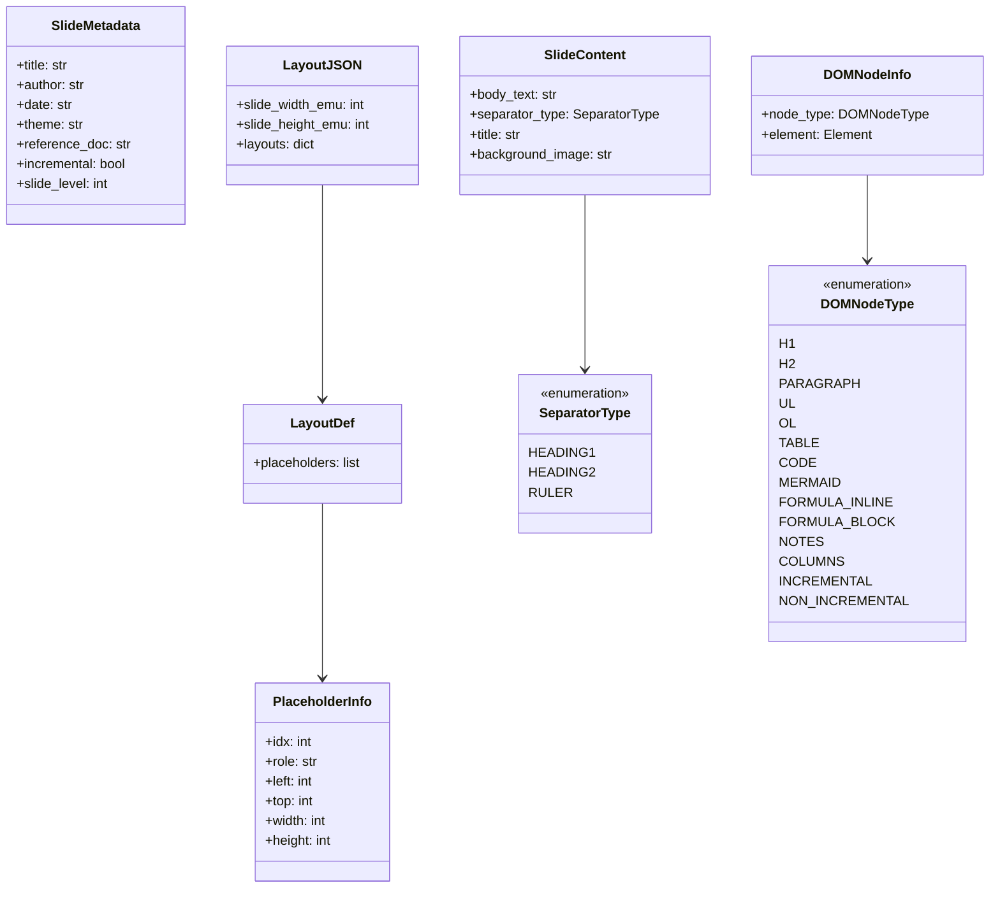
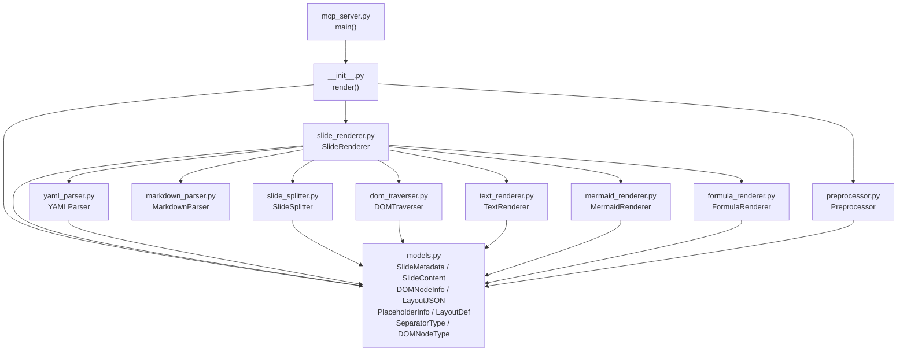
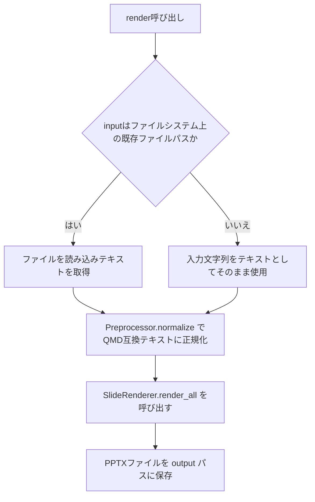
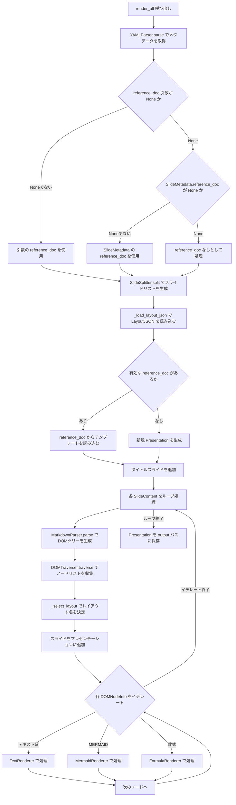
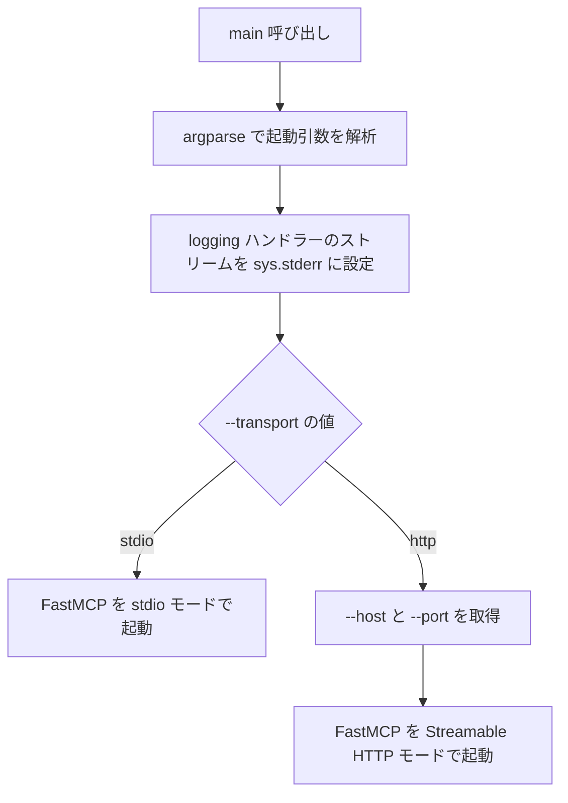

# QMD → PPTX 変換ライブラリ クラス・実装設計書

## 1. ディレクトリ構成

### 1.1 ディレクトリツリー

```
qmd_to_pptx/（リポジトリルート）
├── pyproject.toml
├── README.md
├── AGENTS.md
├── .gitignore
├── generate_default_layout.py
├── docs/
│   ├── QMD_TO_PPTX_DESIGN.md
│   └── CLASS_IMPLEMENT_DESIGN.md
└── src/
    └── qmd_to_pptx/
        ├── __init__.py
        ├── models.py
        ├── preprocessor.py
        ├── yaml_parser.py
        ├── slide_splitter.py
        ├── markdown_parser.py
        ├── dom_traverser.py
        ├── slide_renderer.py
        ├── text_renderer.py
        ├── mermaid_renderer.py
        ├── formula_renderer.py
        ├── mcp_server.py
        └── resources/
            └── default_layout.json
```

### 1.2 各ファイル・ディレクトリの役割

| パス | 役割 |
|---|---|
| `pyproject.toml` | パッケージメタデータ・依存関係・ビルドシステム設定 |
| `generate_default_layout.py` | `custom-template.pptx` から `default_layout.json` を生成する開発用スクリプト。パッケージには含めない |
| `docs/QMD_TO_PPTX_DESIGN.md` | コンポーネント・API・アーキテクチャの設計書 |
| `docs/CLASS_IMPLEMENT_DESIGN.md` | クラス・データ構造・実装詳細の設計書（本ドキュメント） |
| `src/qmd_to_pptx/__init__.py` | パッケージのエントリーポイント。外部に公開する `render()` 関数を定義する |
| `src/qmd_to_pptx/models.py` | 全コンポーネントが共有するデータクラスおよびEnumを定義する。他モジュールへの依存を持たない |
| `src/qmd_to_pptx/preprocessor.py` | 前処理器クラス `Preprocessor` を定義する |
| `src/qmd_to_pptx/yaml_parser.py` | YAMLパーサークラス `YAMLParser` を定義する |
| `src/qmd_to_pptx/slide_splitter.py` | スライド分割器クラス `SlideSplitter` を定義する |
| `src/qmd_to_pptx/markdown_parser.py` | Markdownパーサークラス `MarkdownParser` を定義する |
| `src/qmd_to_pptx/dom_traverser.py` | DOMトラバーサークラス `DOMTraverser` を定義する |
| `src/qmd_to_pptx/slide_renderer.py` | スライドレンダラークラス `SlideRenderer` を定義する。各コンポーネントを呼び出す中心的なオーケストレーター |
| `src/qmd_to_pptx/text_renderer.py` | テキストレンダラークラス `TextRenderer` を定義する |
| `src/qmd_to_pptx/mermaid_renderer.py` | Mermaidレンダラークラス `MermaidRenderer` を定義する |
| `src/qmd_to_pptx/formula_renderer.py` | 数式レンダラークラス `FormulaRenderer` を定義する |
| `src/qmd_to_pptx/mcp_server.py` | MCPサーバーのエントリーポイント。`main()` 関数を `[project.scripts]` として公開する |
| `src/qmd_to_pptx/resources/default_layout.json` | スライドレイアウト座標定義JSON。パッケージデータとして同梱される |

---

## 2. パッケージング設計

### 2.1 pyproject.toml の設定概要

ビルドバックエンドに `hatchling` を使用し、src-layout を採用する。

**[project] セクション**

| キー | 値 |
|---|---|
| `name` | `qmd-to-pptx` |
| `version` | `0.1.0` |
| `requires-python` | `>=3.11` |
| `dependencies` | `markdown`, `pymdown-extensions`, `mermaid-parser-py`, `networkx`, `python-pptx`, `latex2mathml`, `mathml2omml`, `mcp[cli]` |

**[project.scripts] セクション**

| スクリプト名 | エントリーポイント |
|---|---|
| `qmd-to-pptx-mcp` | `qmd_to_pptx.mcp_server:main` |

**[build-system] セクション**

| キー | 値 |
|---|---|
| `requires` | `["hatchling"]` |
| `build-backend` | `"hatchling.build"` |

**[tool.hatch.build.targets.wheel] セクション**

| キー | 値 |
|---|---|
| `packages` | `["src/qmd_to_pptx"]` |

`src/qmd_to_pptx/resources/` ディレクトリ以下のファイルはパッケージディレクトリ内に存在するため、hatchling が自動的にwheelに含める。

### 2.2 ライブラリとしての取り込み方法（uv）

別プロジェクトにライブラリとして追加する場合は `uv add` コマンドを使用する。PyPI公開後はパッケージ名 `qmd-to-pptx` を指定して追加する。ローカル開発中はリポジトリパスを直接指定して追加できる。

### 2.3 MCPサーバーの実行方法（uvx）

`uvx` を使用すると、専用の仮想環境を自動生成してMCPサーバーを起動できる。`--from` オプションでパッケージ名 `qmd-to-pptx` を指定し、スクリプト名 `qmd-to-pptx-mcp` を実行する。トランスポート方式は `--transport` 引数で `stdio`（デフォルト）または `http` を選択する。

---

## 3. クラス設計

### 3.1 クラス一覧

| クラス名 | ファイル | 対応コンポーネント（QMD_TO_PPTX_DESIGN.md） |
|---|---|---|
| `Preprocessor` | `preprocessor.py` | 前処理器（4.0節） |
| `YAMLParser` | `yaml_parser.py` | YAMLパーサー（4.1節） |
| `SlideSplitter` | `slide_splitter.py` | スライド分割器（4.2節） |
| `MarkdownParser` | `markdown_parser.py` | Markdownパーサー（4.3節） |
| `DOMTraverser` | `dom_traverser.py` | DOMトラバーサー（4.4節） |
| `TextRenderer` | `text_renderer.py` | テキストレンダラー（4.5節） |
| `MermaidRenderer` | `mermaid_renderer.py` | Mermaidレンダラー（4.6節） |
| `FormulaRenderer` | `formula_renderer.py` | 数式レンダラー（4.7節） |
| `SlideRenderer` | `slide_renderer.py` | スライドレンダラー（4.8節） |

### 3.2 処理クラス図



### 3.3 データモデル図



### 3.4 各クラスの詳細設計

#### Preprocessor

| メソッド | 引数 | 戻り値 | 処理内容 |
|---|---|---|---|
| `normalize` | `text: str` | `str` | YAMLフロントマター補完・Mermaid記法統一・コードブロック記法統一を順に適用し、正規化済みQMDテキストを返す |

#### YAMLParser

| メソッド | 引数 | 戻り値 | 処理内容 |
|---|---|---|---|
| `parse` | `text: str` | `SlideMetadata` | テキスト先頭のYAMLフロントマターブロックを抽出し、全フィールドを解析して `SlideMetadata` を生成して返す |

#### SlideSplitter

| メソッド | 引数 | 戻り値 | 処理内容 |
|---|---|---|---|
| `split` | `text: str`, `slide_level: int` | `list[SlideContent]` | `slide_level` に基づく見出し区切りと水平区切り線でテキストをスライド単位に分割し、`SlideContent` のリストを返す |

#### MarkdownParser

| メソッド | 引数 | 戻り値 | 処理内容 |
|---|---|---|---|
| `parse` | `text: str` | `Element` | `pymdownx.superfences`・`pymdownx.arithmatex`・`tables`・`fenced_code` の各extensionを適用し、MarkdownをHTMLに変換してDOMツリーのルート `Element` を返す |

#### DOMTraverser

| メソッド | 引数 | 戻り値 | 処理内容 |
|---|---|---|---|
| `traverse` | `root: Element` | `list[DOMNodeInfo]` | DOMツリーを深さ優先で走査し、ノード種別をタグ名・クラス属性で判定した `DOMNodeInfo` のリストを生成して返す |

#### SlideRenderer

| メソッド | 引数 | 戻り値 | 処理内容 |
|---|---|---|---|
| `render_all` | `normalized_text: str`, `output: str`, `reference_doc: str \| None` | `None` | YAMLパーサー・スライド分割器・Markdownパーサー・DOMトラバーサーを順に呼び出し、全スライドを生成して指定パスに保存する |
| `_load_layout_json` | なし | `LayoutJSON` | パッケージ同梱の `resources/default_layout.json` を読み込み `LayoutJSON` オブジェクトを生成する |
| `_select_layout` | `content: SlideContent`, `nodes: list[DOMNodeInfo]` | `str` | `SlideContent` の区切り種別と `nodes` 内のノード構成（`.columns` divの有無・テキスト/非テキストの混在）を元に `QMD_TO_PPTX_DESIGN.md` 4.8節のレイアウト自動選択ルールを適用してレイアウト名を返す |
| `_resolve_placeholder` | `slide`, `idx: int` | `bool` | `slide.placeholders` に指定 `idx` が存在する場合は `True` を返す |
| `_write_via_placeholder` | `slide`, `idx: int`, `element: Element` | `None` | `slide.placeholders[idx]` を取得し、テキスト系ノードはそのshapeを `TextRenderer` の対応メソッドに渡してコンテンツを書き込む。テーブルノードはプレースホルダーの座標を取得して `TextRenderer.render_table()` を呼び出す（パターンB・Dで使用） |
| `_write_via_textbox` | `slide`, `role: str`, `layout_def: LayoutDef`, `element: Element` | `None` | `LayoutDef.placeholders` を `role` で線形探索して座標情報を取得し、テキスト系ノードは `add_textbox()` で作成したshapeを `TextRenderer` の対応メソッドに渡して書き込む。テーブルノードは `TextRenderer.render_table()` に座標を渡す（パターンA・C・Dで使用） |

**プレースホルダーパターン適用方針：**

| パターン | `reference_doc` の有無 | プレースホルダーの状態 | 適用メソッド |
|---|---|---|---|
| A | なし | — | `_write_via_textbox` のみ |
| B | あり | 全 idx が存在する | `_write_via_placeholder` のみ |
| C | あり | 1つも存在しない | `_write_via_textbox` のみ |
| D | あり | 一部の idx が欠けている | idx ごとに `_resolve_placeholder` で判定し、存在する idx は `_write_via_placeholder`、存在しない idx は `_write_via_textbox` |

#### TextRenderer

`SlideRenderer` から `DOMNodeInfo.element` を受け取り、対応するpython-pptxのShapeをスライドに追加する。

| メソッド | 引数 | 戻り値 | 処理内容 |
|---|---|---|---|
| `render_heading` | `shape`, `element: Element`, `level: int` | `None` | `shape`（プレースホルダーまたはtextbox）のテキストフレームに、`level` に応じたスタイルで見出しテキストを書き込む |
| `render_paragraph` | `shape`, `element: Element` | `None` | `shape` のテキストフレームに段落テキストを書き込む |
| `render_list` | `shape`, `element: Element`, `incremental: bool` | `None` | `shape` のテキストフレームにインデント付きの箇条書きリストを書き込む。`incremental=True` の場合はアニメーション逐次表示を設定する |
| `render_table` | `slide`, `element: Element`, `left: int`, `top: int`, `width: int`, `height: int` | `None` | `slide.shapes.add_table()` で指定座標にテーブルShapeを生成し、`<table>` 要素の内容を書き込む |
| `render_code` | `shape`, `element: Element` | `None` | `shape` のテキストフレームに等幅フォントでコードテキストを書き込む |
| `render_notes` | `slide`, `element: Element` | `None` | `element` のテキストをスライドのノートテキストフレームに書き込む |

#### MermaidRenderer

| メソッド | 引数 | 戻り値 | 処理内容 |
|---|---|---|---|
| `render` | `slide`, `element: Element`, `left: int`, `top: int`, `width: int`, `height: int` | `None` | `element` からMermaidテキストを取り出し、mermaid-parser-pyでパース、NetworkXの `spring_layout` で座標計算後、python-pptxのShape/Connectorとして指定座標に描画する |

#### FormulaRenderer

| メソッド | 引数 | 戻り値 | 処理内容 |
|---|---|---|---|
| `render_inline` | `run`, `element: Element` | `None` | `element` からLaTeXテキストを取り出し、latex2mathmlでMathML、mathml2ommlでOMMLに変換して `run` のXMLに埋め込む |
| `render_block` | `slide`, `element: Element`, `left: int`, `top: int`, `width: int`, `height: int` | `None` | `element` からLaTeXテキストを取り出し、OMMLに変換して指定座標の数式Shapeとしてスライドに配置する |

---

## 4. データ構造設計

全コンポーネントが共有するデータクラスおよびEnumは `models.py` にまとめて定義する。

### 4.1 Enum定義

#### SeparatorType

スライド区切りの種別を表す。

| 値 | 意味 |
|---|---|
| `HEADING1` | `#` で始まるレベル1見出し。Section Headerスライドを生成する（`slide-level: 2` の場合） |
| `HEADING2` | `##` で始まるレベル2見出し。通常のコンテンツスライドを生成する（`slide-level: 2` の場合） |
| `RULER` | `---` 水平区切り線。タイトルなしスライドを生成する |

#### DOMNodeType

DOMトラバーサーが識別するノードの種別を表す。

| 値 | 対応するDOMノード | 判定方法 |
|---|---|---|
| `H1` | `<h1>` | タグ名 |
| `H2` | `<h2>` | タグ名 |
| `PARAGRAPH` | `<p>` | タグ名 |
| `UL` | `<ul>` | タグ名 |
| `OL` | `<ol>` | タグ名 |
| `TABLE` | `<table>` | タグ名 |
| `CODE` | `<code>`（Mermaid以外） | タグ名かつクラス属性が `language-mermaid` でない |
| `MERMAID` | `<code class="language-mermaid">` | タグ名がcodeかつクラス属性が `language-mermaid` |
| `FORMULA_INLINE` | `<span class="arithmatex">` | タグ名がspanかつクラス属性が `arithmatex` |
| `FORMULA_BLOCK` | `<div class="arithmatex">` | タグ名がdivかつクラス属性が `arithmatex` |
| `NOTES` | `<div class="notes">` | タグ名がdivかつクラス属性が `notes` |
| `COLUMNS` | `<div class="columns">` | タグ名がdivかつクラス属性が `columns` |
| `INCREMENTAL` | `<div class="incremental">` | タグ名がdivかつクラス属性が `incremental` |
| `NON_INCREMENTAL` | `<div class="nonincremental">` | タグ名がdivかつクラス属性が `nonincremental` |

### 4.2 データクラス定義

#### SlideMetadata

YAMLパーサーが生成し、スライドレンダラーへ渡すメタデータ。

| フィールド | 型 | 説明 |
|---|---|---|
| `title` | `str` | プレゼンテーションのタイトル。未設定時は空文字 |
| `author` | `str` | 作成者名。未設定時は空文字 |
| `date` | `str` | 作成日。未設定時は空文字 |
| `theme` | `str` | スライドテーマ名。未設定時は空文字 |
| `reference_doc` | `str \| None` | YAMLフロントマターの `format.pptx.reference-doc` の値。未設定時は `None` |
| `incremental` | `bool` | リストのデフォルト逐次表示設定。未設定時は `False` |
| `slide_level` | `int` | スライド区切りとして扱う見出しレベル（1または2）。未設定時は `2` |

#### SlideContent

スライド分割器が生成し、スライドレンダラーへ渡す各スライドの内容。

| フィールド | 型 | 説明 |
|---|---|---|
| `body_text` | `str` | スライド本文のMarkdownテキスト |
| `separator_type` | `SeparatorType` | このスライドを生成した区切りの種別 |
| `title` | `str` | 見出し行から抽出したスライドタイトル。水平区切り線由来の場合は空文字 |
| `background_image` | `str \| None` | `{background-image="..."}` 属性で指定された画像パス。未指定時は `None` |

#### DOMNodeInfo

DOMトラバーサーがyieldするノード情報。

| フィールド | 型 | 説明 |
|---|---|---|
| `node_type` | `DOMNodeType` | ノードの種別 |
| `element` | `Element` | ElementTree形式のノード要素 |

#### PlaceholderInfo

レイアウトJSONの各プレースホルダー定義。`QMD_TO_PPTX_DESIGN.md` 4.9節のスキーマに対応する。

| フィールド | 型 | 説明 |
|---|---|---|
| `idx` | `int` | python-pptxの `placeholder_format.idx` に対応するプレースホルダー番号 |
| `role` | `str` | コンテンツの役割（`title` / `body` / `subtitle` / `left_content` / `right_content` / `left_header` / `right_header` / `caption`） |
| `left` | `int` | 左端座標（EMU） |
| `top` | `int` | 上端座標（EMU） |
| `width` | `int` | 幅（EMU） |
| `height` | `int` | 高さ（EMU） |

#### LayoutDef

レイアウト1つ分のプレースホルダー集合。

| フィールド | 型 | 説明 |
|---|---|---|
| `placeholders` | `list[PlaceholderInfo]` | そのレイアウトに属するプレースホルダーのリスト |

#### LayoutJSON

`default_layout.json` 全体を表すトップレベルオブジェクト。

| フィールド | 型 | 説明 |
|---|---|---|
| `slide_width_emu` | `int` | スライド幅（EMU） |
| `slide_height_emu` | `int` | スライド高さ（EMU） |
| `layouts` | `dict[str, LayoutDef]` | レイアウト名をキー、`LayoutDef` を値とする辞書 |

---

## 5. モジュール間依存関係



`models.py` は全モジュールから参照される共有データ定義であり、パッケージ内の他モジュールへの依存を持たない。`mcp_server.py` はライブラリのエントリーポイントである `__init__.py` の `render()` 関数を呼び出す。

---

## 6. パブリックAPI設計

### 6.1 render() 関数の仕様

`__init__.py` で外部に公開する唯一のパブリック関数。

| 引数名 | 型 | 必須/省略可 | 説明 |
|---|---|---|---|
| `input` | `str` | 必須 | QMDまたはMarkdownのファイルパス、あるいはいずれかのテキスト文字列 |
| `output` | `str` | 必須 | 出力先PPTXファイルのパス |
| `reference_doc` | `str \| None` | 省略可（デフォルト: `None`） | ベースとなるPPTXテンプレートファイルのパス |

戻り値: なし（`None`）

### 6.2 render() 内部の処理フロー



`reference_doc` 引数は `SlideRenderer.render_all()` へそのまま渡される。YAMLフロントマターに `format.pptx.reference-doc` が記述されている場合も `render()` の引数値が優先される。

### 6.3 SlideRenderer.render_all() 内部の処理フロー



各コンテンツを配置する際、`_resolve_placeholder` でプレースホルダーの存在を確認し、存在する場合は `_write_via_placeholder`、存在しない場合は `_write_via_textbox` を呼び出すことで、パターンA〜Dを透過的に処理する。

---

## 7. MCPサーバー設計

### 7.1 mcp_server.py の構成

`mcp_server.py` は `FastMCP` インスタンスを1つ生成し、`markdown_to_pptx` ツールを登録する。コマンドラインエントリーポイントは `main()` 関数である。

| 要素 | 内容 |
|---|---|
| `FastMCP` サーバー名 | `qmd_to_pptx` |
| 公開ツール名 | `markdown_to_pptx` |
| ツール引数 | `content: str`（必須）・`output: str`（必須）・`reference_doc: str \| None`（省略可、デフォルト `None`） |
| エントリーポイント関数 | `main()` |

ツール内部では `render()` 関数に `content`・`output`・`reference_doc` を渡し、処理結果を文字列メッセージとして返す。

### 7.2 main() の処理フロー



`main()` は `logging` ハンドラーのストリームを `sys.stderr` に設定してから `mcp.run()` を呼び出す。stdout への書き出しは行わない。

### 7.3 起動引数仕様

| 引数名 | 型 | デフォルト | 内容 |
|---|---|---|---|
| `--transport` | `stdio` / `http` | `stdio` | トランスポート方式 |
| `--host` | 文字列 | `0.0.0.0` | HTTPモード時のバインドアドレス |
| `--port` | 整数 | `8000` | HTTPモード時のポート番号 |

### 7.4 uvx による起動設定

| 設定項目 | 内容 |
|---|---|
| `--from` に指定するパッケージ名 | `qmd-to-pptx` |
| 実行するスクリプト名 | `qmd-to-pptx-mcp` |

### 7.5 Claude Desktop 登録設定

Claude Desktopに `stdio` モードで登録する際は `claude_desktop_config.json` の `mcpServers` キーに以下の設定を追加する。

| 設定項目 | 内容 |
|---|---|
| `command` | `uvx` の絶対パス |
| `args[0]` | `--from` |
| `args[1]` | `qmd-to-pptx` |
| `args[2]` | `qmd-to-pptx-mcp` |
| `args[3]` | `--transport` |
| `args[4]` | `stdio` |
