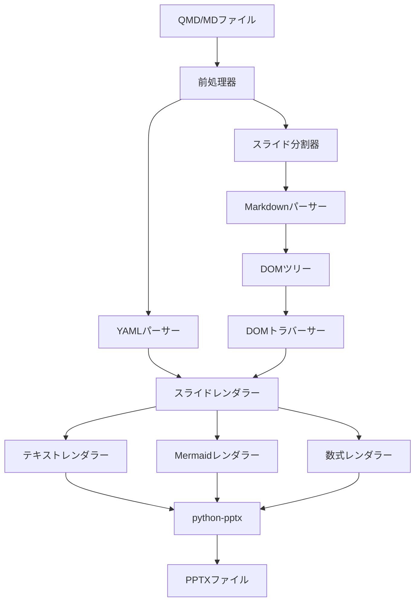
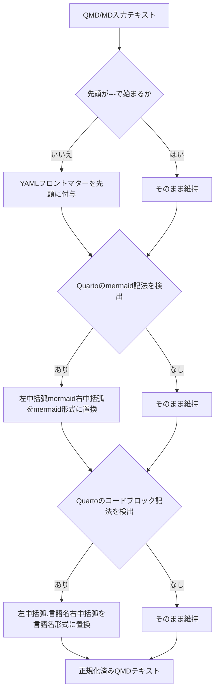
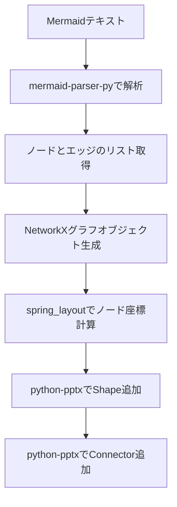
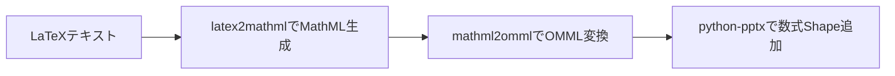
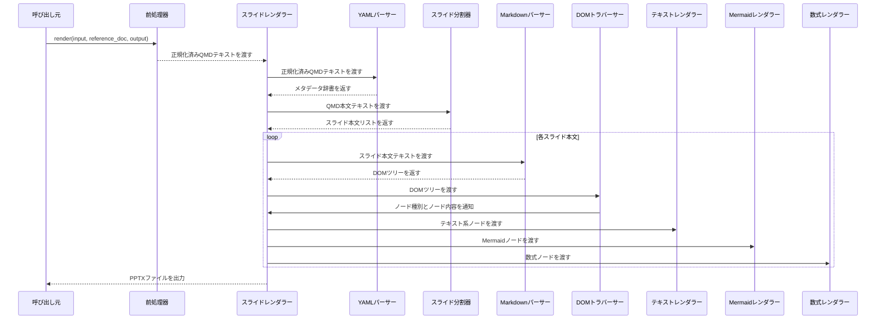

# QMD → PPTX 変換ライブラリ 設計書

## 1. 概要

本ドキュメントは、Quarto Markdown（`.qmd`）および通常の Markdown（`.md`）ファイルを解析し、指定された PowerPoint テンプレートを基に `.pptx` ファイルを生成する Python ライブラリの設計を記述する。入力はまず前処理器により QMD 互換形式へ正規化され、以降は共通パイプラインで処理される。

---

## 2. 全体アーキテクチャ

ライブラリは以下の9つの主要コンポーネントで構成される。各コンポーネントは入力を受け取り、処理結果を次のコンポーネントへ渡すパイプライン構造を取る。



### 使用ライブラリ一覧

| 用途 | ライブラリ |
|---|---|
| Markdown解析 | Python-Markdown |
| Mermaid解析 | mermaid-parser-py |
| グラフレイアウト | NetworkX |
| PowerPoint生成 | python-pptx |
| LaTeX → MathML変換 | latex2mathml |

---

## 3. 処理フロー

QMDファイルの入力から PPTXファイルの出力までの全体の処理順序を以下に示す。


---

## 4. 各コンポーネント設計

### 4.0 前処理器（Preprocessor）

**責務：** `.qmd` または `.md` 形式の入力テキストを受け取り、後段の共通パイプラインが期待する QMD 互換形式へ正規化して渡す。QMD ファイルをそのまま入力した場合は変換なしでそのまま後段へ渡す。

**正規化処理の内容：**

| 処理名 | 検出条件 | 正規化内容 |
|---|---|---|
| YAMLフロントマター補完 | テキスト先頭が `---\n` で始まらない | `title`/`author`/`date` を空値としたYAMLフロントマターブロックをテキスト先頭に付与する |
| Mermaid記法の統一 | バッククォート3つ + `{mermaid}` で始まるコードブロック（Quartoのネイティブ記法） | ` ```mermaid ` 形式に置換する |
| コードブロック記法の統一 | バッククォート3つ + `{言語名}` または `{.言語名}` で始まるコードブロック（Quartoのコード実行用記法） | ` ```言語名 ` 形式に置換する（例：` ```{python}` → ` ```python`） |

**処理詳細：**

1. 入力テキストの先頭が `---\n` で始まるか判定する。始まらない場合は、`title`/`author`/`date` をすべて空文字とした最小限のYAMLフロントマターブロックをテキスト先頭に挿入する
2. テキスト全体を走査し、バッククォート3つに続いて `{mermaid}` で始まるコードブロック（Quartoのネイティブ記法）を検出し、` ```mermaid ` 形式に一括置換する。既に ` ```mermaid ` 形式になっているブロックはそのまま維持する
3. テキスト全体を走査し、バッククォート3つに続いて `{言語名}` または `{.言語名}` で始まるコードブロック（Quartoのコード実行用記法）を検出し、` ```言語名 ` 形式に一括置換する（例：` ```{python}` → ` ```python`）
4. 正規化済みテキストをYAMLパーサーおよびスライド分割器へ渡す



---

### 4.1 YAMLパーサー

**責務：** QMDファイル先頭のYAMLフロントマターブロック（`---` で囲まれた領域）を抽出し、メタデータとして解析する。

**解析対象フィールド：**

| フィールド名 | 内容 | 欠落時の挙動 |
|---|---|---|
| title | プレゼンテーションのタイトル | 空文字として扱う（前処理器により補完済み） |
| author | 作成者名 | 空文字として扱う（前処理器により補完済み） |
| date | 作成日 | 空文字として扱う（前処理器により補完済み） |
| format | 出力フォーマット（pptx固定） | 省略可 |
| theme | スライドテーマ名 | 省略可 |
| format.pptx.reference-doc | 使用するPPTXテンプレートファイルパス | `render` 関数の `reference_doc` 引数で代替 |
| format.pptx.incremental | リストのインクリメンタル表示（逐次表示）をデフォルトで有効にするかどうか（`true` / `false`） | 省略時は `false`（全アイテム一括表示） |
| slide-level | スライド区切りとして扱う見出しレベル（1 または 2） | 省略時は `2`（`##` 見出しがスライド区切りとなり、`#` 見出しは Section Header になる） |

テンプレートファイルパスはYAML階層の `format` > `pptx` > `reference-doc` という入れ子構造で指定される。前処理器がフロントマターを補完するため、このコンポーネントが受け取る時点では必ずフロントマターブロックが存在する。

**処理詳細：**

YAMLフロントマターブロックをQMDテキストの先頭から検出し、ブロック内のキーと値を辞書形式で保持する。`format.pptx.reference-doc` の値は階層を辿って取得し、スライドレンダラーへ引き渡す。`title`/`author`/`date` が空文字であっても正常な辞書として返す。

---

### 4.2 スライド分割器

**責務：** QMD本文テキストをスライド単位に分割し、各スライドの本文テキストのリストを生成する。

**分割ルール：**

Quartoの仕様に従い、以下の3通りの区切り記号でスライドを分割する。各区切り種別は生成されるスライドのレイアウト種別とも対応している。

| 区切り種別 | 記法 | 生成されるスライドタイプ |
|---|---|---|
| レベル1見出し | `#` で始まる行 | セクションヘッダースライド（Section Header） |
| レベル2見出し | `##` で始まる行 | 通常のコンテンツスライド（Title and Content） |
| 水平区切り線 | `---` | タイトルなしスライド（Blank または Title and Content） |

分割の結果、各スライドに対応する本文テキスト・区切り種別・背景画像パスのリストを生成し、後段のMarkdownパーサーへ順に渡す。

**見出し属性（background-image）の解析：**

Quartoでは `## Slide Title {background-image="background.png"}` の形式で見出し行に属性を付与できる。スライド分割器はこの形式を正規表現で検出し、`background-image` の値をそのスライドのメタデータとして保持する。見出し本文から属性ブロック部分を除去した上で、本文テキストとともにスライドレンダラーへ渡す。

**`slide-level` オプションの効果：**

YAMLフロントマターで `slide-level` を指定することで、スライド区切りとして扱う見出しレベルが変化する。省略時のデフォルトは `2`。

| `slide-level` 値 | スライド区切り見出し | Section Header 見出し |
|---|---|---|
| 1 | `#` のみ | なし（`#` 見出しが通常のコンテンツスライドになる） |
| 2（デフォルト） | `##` | `#` |

---

### 4.3 Markdownパーサー

**責務：** スライド分割器が生成した各スライドのMarkdownテキストをHTMLに変換し、ElementTree形式のDOMツリーを生成する。

**使用するextension：**

| extension名 | 役割 |
|---|---|
| pymdownx.superfences | コードフェンスの拡張対応（カスタムフェンス設定を含む） |
| pymdownx.arithmatex | LaTeX数式ブロックの検出とマーキング |
| tables | Markdown表の変換 |
| fenced_code | フェンスコードブロックの変換 |

**Mermaidカスタムフェンス設定：**

Quartoでは Mermaid を ` ```{mermaid}` という記法のコードブロックで記述するが、`pymdownx.superfences` の `custom_fences` はこの形式を認識しない（`{mermaid}` はクラス属性として解釈されず、カスタムフェンスへのマッチングが成立しない）。そのため前処理器が事前に ` ```mermaid` 形式へ変換してからこのコンポーネントへ渡す。`pymdownx.superfences` にカスタムフェンスとして `mermaid` を登録することで、` ```mermaid` ブロックをクラス属性 `language-mermaid` を持つ `code` 要素に変換する。この設定を行わない場合、Mermaidブロックは通常のコードブロックとして扱われ、DOMトラバーサーによる識別が機能しない。

**処理詳細：**

`pymdownx.superfences` の `custom_fences` に `mermaid` クラスを登録した上で、Python-Markdownライブラリに上記extensionを適用してMarkdownテキストをHTMLへ変換する。変換結果をElementTree形式でパースしてDOMツリーを生成し、DOMトラバーサーへ渡す。

---

### 4.4 DOMトラバーサー

**責務：** Markdownパーサーが生成したElementTree形式のDOMツリーを走査し、各ノードの種別を判定してスライドレンダラーへノード情報を通知する。

**対象ノード種別と判定方法：**

| DOMノード | 判定方法 |
|---|---|
| h1 / h2 | タグ名による判定 |
| p（段落） | タグ名による判定 |
| ul / ol（リスト） | タグ名による判定 |
| table | タグ名による判定 |
| code（Mermaid） | タグ名がcodeかつクラス属性が `language-mermaid` |
| 数式（arithmatex） | クラス属性が `arithmatex` のspanまたはdiv |
| スピーカーノート | クラス属性が `notes` のdiv |
| 2カラムコンテナ | クラス属性が `columns` のdiv（内部に `column` クラスdivを1つ以上含む） |
| インクリメンタルリスト | クラス属性が `incremental` のdiv（内部に `ul` または `ol` を含む） |
| 非インクリメンタルリスト | クラス属性が `nonincremental` のdiv（内部に `ul` または `ol` を含む） |

**処理詳細：**

DOMツリーのルートから深さ優先でノードを走査する。ノードの種別を上記の判定方法で識別し、ノード種別とノード内容をスライドレンダラーへ通知する。スライドレンダラーは通知を受けて対応するレンダラー（テキスト・Mermaid・数式）を呼び出す。

---

### 4.5 テキストレンダラー

**責務：** DOMトラバーサーから受け取ったテキスト系ノード（見出し・段落・リスト・表・コードブロック）をpython-pptxのShapeとして現在のスライドに追加する。

**DOM → PowerPointマッピング：**

| DOMノード | PowerPoint要素 |
|---|---|
| h1 | スライドのタイトルテキストボックス |
| h2 | スライドの見出しテキストボックス |
| p（段落） | テキストボックス |
| ul / ol | 箇条書きテキストボックス（インデントで階層表現） |
| table | PowerPointテーブルShape |
| code（非Mermaid） | テキストボックス（等幅フォント） |
| `.notes` div | スライドのノートテキストフレーム |
| `.column` div | 2カラムレイアウト時の各コンテンツ領域 |
| `.incremental` div内の `ul`/`ol` | 箇条書きテキストボックス（アニメーション設定：逐次表示） |
| `.nonincremental` div内の `ul`/`ol` | 箇条書きテキストボックス（アニメーション設定：一括表示） |

---

### 4.6 Mermaidレンダラー

**責務：** Mermaid記法のテキストをパースしてグラフ構造を取得し、python-pptxのShapeとして現在のスライドに図を描画する。



**処理詳細：**

1. mermaid-parser-pyを用いてMermaidテキストからノードとエッジの情報を抽出する
2. 抽出した情報を基にNetworkXのグラフオブジェクトを構築する
3. NetworkXの`spring_layout`アルゴリズムを適用して各ノードの2次元座標を計算する
4. 計算した座標を元に`add_shape()`でノードを矩形Shapeとしてスライドに配置する
5. エッジ情報を元に`add_connector()`でノード間をコネクターShapeで接続する

---

### 4.7 数式レンダラー

**責務：** arithmatexによりマーキングされたLaTeX数式テキストをOMML（Office Math Markup Language）形式に変換し、python-pptxの数式オブジェクトとして現在のスライドに追加する。



**処理詳細：**

1. DOMノードのクラス属性（`arithmatex`）からLaTeXテキストを取り出す
2. latex2mathmlライブラリを用いてLaTeXをMathML形式に変換する
3. MathMLをmathml2ommlライブラリを用いてOMML形式に変換する
4. 変換したOMMLをpython-pptxのXML操作機能を通じてスライドに数式として挿入する

インライン数式（`span.arithmatex`）はテキストボックス内に埋め込み、ブロック数式（`div.arithmatex`）は独立した数式Shapeとして配置する。

---

### 4.8 スライドレンダラー

**責務：** YAMLパーサーから受け取ったメタデータとDOMトラバーサーからの各ノード情報を統合し、テンプレートPPTXを基にスライドを生成・管理する。

**処理詳細：**

1. YAMLフロントマターの `format.pptx.reference-doc` フィールドで指定されたPPTXファイルをpython-pptxでロードし、プレゼンテーションオブジェクトを生成する
2. スライド分割器が生成した各スライド本文の区切り種別・コンテンツ内容・背景画像パスに基づき、後述のレイアウト自動選択ルールで適切なスライドレイアウトを選択して新規スライドをプレゼンテーションに追加する
3. DOMトラバーサーからノード種別の通知を受け、対応するレンダラー（テキスト・Mermaid・数式）を呼び出す
4. `.notes` divのコンテンツをスライドのノートテキストフレームに書き込む
5. `.incremental` divおよび `.nonincremental` div内のリストに対してインクリメンタル表示のアニメーション設定を適用する。YAMLの `format.pptx.incremental: true` が設定されている場合は、div指定がないリストにも逐次表示を適用し、`.nonincremental` div内のリストのみ一括表示とする
6. スライドのメタデータに `background-image` パスが含まれる場合は、そのスライドの背景に指定された画像を設定する
7. 全スライドのレンダリング完了後、プレゼンテーションオブジェクトを指定された出力パスに保存する

**スライドレイアウト自動選択ルール：**

スライドレンダラーはスライドの内容を解析し、以下の優先順位でレイアウトを決定する。

| レイアウト名 | 適用条件 |
|---|---|
| Title Slide | プレゼンテーション冒頭のメタデータ（title・author・date）から自動生成する最初のスライド。これらの値が空文字の場合も空のTitle Slideとして生成する |
| Section Header | `#`（レベル1見出し）による分割で生成されるスライド |
| Two Content | `.columns` divが存在し、内部に2つ以上の `.column` divを含み、各カラムがテキストのみで構成されるスライド |
| Comparison | `.columns` divが存在し、少なくとも1カラムがテキストの後に非テキスト（図・表など）を含むスライド |
| Content with Caption | 1カラム構成でテキストの後に非テキスト（図・表など）が続くスライド |
| Blank | コンテンツが空のスライド（スピーカーノートのみの場合を含む） |
| Title and Content | 上記いずれにも該当しないすべてのスライド |

**テンプレートPPTXの必要要件：**

使用するテンプレートPPTXには上記7つのレイアウト名（英語名）がすべて存在することが必須条件となる。対応するレイアウトが見つからない場合は、デフォルトのPandoc参照PPTXに含まれる同名レイアウトがフォールバックとして使用される。

---

## 5. API設計

ライブラリが外部に公開するメインのエントリーポイントは `render` 関数1つのみとする。

| 引数名 | 型 | 内容 |
|---|---|---|
| input | 文字列 | QMDまたはMarkdownのファイルパス、あるいはいずれかのテキスト文字列 |
| reference_doc | 文字列 | ベースとなるPPTXテンプレートファイルのパス（必須） |
| output | 文字列 | 出力先PPTXファイルのパス |

`render` 関数は内部で 前処理器 → YAMLパーサー → スライド分割器 → Markdownパーサー → DOMトラバーサー → スライドレンダラーの順に各コンポーネントを呼び出し、最終的に指定された `output` パスにPPTXファイルを書き出す。`reference_doc` は必須引数であり、YAMLフロントマターの `format.pptx.reference-doc` フィールドが指定されている場合も `reference_doc` 引数の値を優先する。

---

## 6. コンポーネント間データフロー


