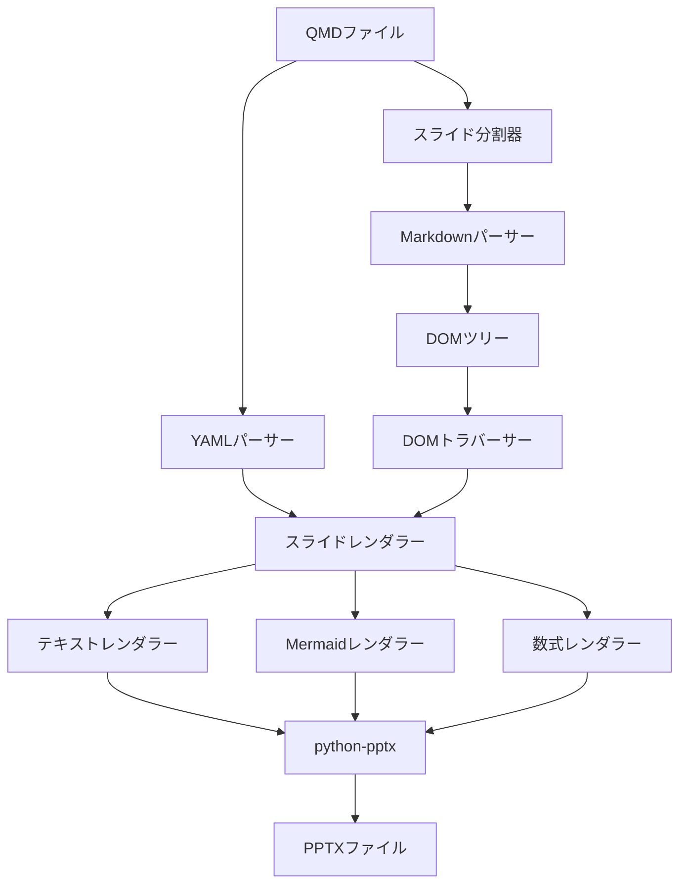
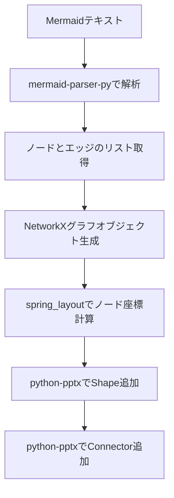
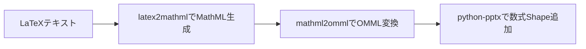
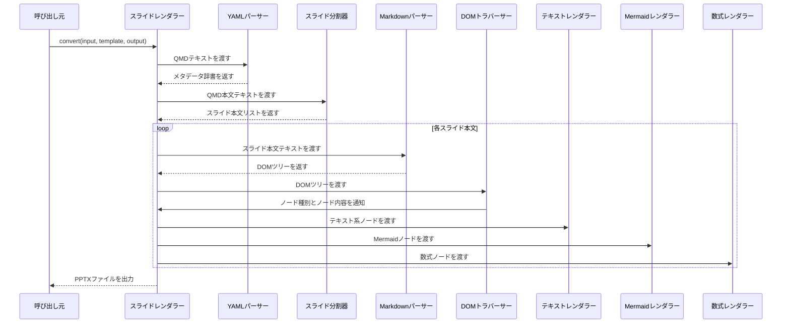

# QMD → PPTX 変換ライブラリ 設計書

## 1. 概要

本ドキュメントは、Quarto Markdown（`.qmd`）ファイルを解析し、指定された PowerPoint テンプレートを基に `.pptx` ファイルを生成する Python ライブラリの設計を記述する。

---

## 2. 全体アーキテクチャ

ライブラリは以下の8つの主要コンポーネントで構成される。各コンポーネントは入力を受け取り、処理結果を次のコンポーネントへ渡すパイプライン構造を取る。

### 使用ライブラリ一覧

| 用途 | ライブラリ |
|---|---|
| Markdown解析 | Python-Markdown |
| Mermaid解析 | mermaid-parser-py |
| グラフレイアウト | NetworkX |
| PowerPoint生成 | python-pptx |
| LaTeX → MathML変換 | latex2mathml |

---

## 3. 処理フロー

QMDファイルの入力から PPTXファイルの出力までの全体の処理順序を以下に示す。

---

## 4. 各コンポーネント設計

### 4.1 YAMLパーサー

**責務：** QMDファイル先頭のYAMLフロントマターブロック（`---` で囲まれた領域）を抽出し、メタデータとして解析する。

**解析対象フィールド：**

| フィールド名 | 内容 |
|---|---|
| title | プレゼンテーションのタイトル |
| format | 出力フォーマット（pptx固定） |
| theme | スライドテーマ名 |
| template | 使用するPPTXテンプレートファイルパス |

**処理詳細：**

YAMLフロントマターブロックをQMDファイルの先頭から検出し、ブロック内のキーと値を辞書形式で保持する。解析結果はスライドレンダラーへ引き渡す。

---

### 4.2 スライド分割器

**責務：** QMD本文テキストをスライド単位に分割し、各スライドの本文テキストのリストを生成する。

**分割ルール：**

Quartoの仕様に従い、以下の2通りの区切り記号でスライドを分割する。

- 水平区切り線（`---`）が出現した箇所でスライドを分割する
- レベル2の見出し（`##` で始まる行）が出現した箇所でスライドを分割する

分割の結果、各スライドに対応する本文テキストのリストを生成し、後段のMarkdownパーサーへ順に渡す。

---

### 4.3 Markdownパーサー

**責務：** スライド分割器が生成した各スライドのMarkdownテキストをHTMLに変換し、ElementTree形式のDOMツリーを生成する。

**使用するextension：**

| extension名 | 役割 |
|---|---|
| pymdownx.superfences | コードフェンスの拡張対応 |
| pymdownx.arithmatex | LaTeX数式ブロックの検出とマーキング |
| tables | Markdown表の変換 |
| fenced_code | フェンスコードブロックの変換 |

**処理詳細：**

Python-Markdownライブラリに上記extensionを適用してMarkdownテキストをHTMLへ変換し、その結果をElementTree形式でパースしてDOMツリーを生成する。DOMツリーはDOMトラバーサーへ渡す。

---

### 4.4 DOMトラバーサー

**責務：** Markdownパーサーが生成したElementTree形式のDOMツリーを走査し、各ノードの種別を判定してスライドレンダラーへノード情報を通知する。

**対象ノード種別と判定方法：**

| DOMノード | 判定方法 |
|---|---|
| h1 / h2 | タグ名による判定 |
| p（段落） | タグ名による判定 |
| ul / ol（リスト） | タグ名による判定 |
| table | タグ名による判定 |
| code（Mermaid） | タグ名がcodeかつクラス属性が `language-mermaid` |
| 数式（arithmatex） | クラス属性が `arithmatex` のspanまたはdiv |

**処理詳細：**

DOMツリーのルートから深さ優先でノードを走査する。ノードの種別を上記の判定方法で識別し、ノード種別とノード内容をスライドレンダラーへ通知する。スライドレンダラーは通知を受けて対応するレンダラー（テキスト・Mermaid・数式）を呼び出す。

---

### 4.5 テキストレンダラー

**責務：** DOMトラバーサーから受け取ったテキスト系ノード（見出し・段落・リスト・表・コードブロック）をpython-pptxのShapeとして現在のスライドに追加する。

**DOM → PowerPointマッピング：**

| DOMノード | PowerPoint要素 |
|---|---|
| h1 | スライドのタイトルテキストボックス |
| h2 | スライドの見出しテキストボックス |
| p（段落） | テキストボックス |
| ul / ol | 箇条書きテキストボックス（インデントで階層表現） |
| table | PowerPointテーブルShape |
| code（非Mermaid） | テキストボックス（等幅フォント） |

---

### 4.6 Mermaidレンダラー

**責務：** Mermaid記法のテキストをパースしてグラフ構造を取得し、python-pptxのShapeとして現在のスライドに図を描画する。

**処理詳細：**

1. mermaid-parser-pyを用いてMermaidテキストからノードとエッジの情報を抽出する
2. 抽出した情報を基にNetworkXのグラフオブジェクトを構築する
3. NetworkXの`spring_layout`アルゴリズムを適用して各ノードの2次元座標を計算する
4. 計算した座標を元に`add_shape()`でノードを矩形Shapeとしてスライドに配置する
5. エッジ情報を元に`add_connector()`でノード間をコネクターShapeで接続する

---

### 4.7 数式レンダラー

**責務：** arithmatexによりマーキングされたLaTeX数式テキストをOMML（Office Math Markup Language）形式に変換し、python-pptxの数式オブジェクトとして現在のスライドに追加する。

**処理詳細：**

1. DOMノードのクラス属性（`arithmatex`）からLaTeXテキストを取り出す
2. latex2mathmlライブラリを用いてLaTeXをMathML形式に変換する
3. MathMLをmathml2ommlライブラリを用いてOMML形式に変換する
4. 変換したOMMLをpython-pptxのXML操作機能を通じてスライドに数式として挿入する

インライン数式（`span.arithmatex`）はテキストボックス内に埋め込み、ブロック数式（`div.arithmatex`）は独立した数式Shapeとして配置する。

---

### 4.8 スライドレンダラー

**責務：** YAMLパーサーから受け取ったメタデータとDOMトラバーサーからの各ノード情報を統合し、テンプレートPPTXを基にスライドを生成・管理する。

**処理詳細：**

1. YAMLフロントマターの`template`フィールドで指定されたPPTXファイルをpython-pptxでロードし、プレゼンテーションオブジェクトを生成する
2. スライド分割器が生成した各スライド本文に対して、テンプレートのスライドレイアウトを適用した新規スライドをプレゼンテーションに追加する
3. DOMトラバーサーからノード種別の通知を受け、対応するレンダラー（テキスト・Mermaid・数式）を呼び出す
4. 全スライドのレンダリング完了後、プレゼンテーションオブジェクトを指定された出力パスに保存する

---

## 5. API設計

ライブラリが外部に公開するメインのエントリーポイントは `convert` 関数1つのみとする。

| 引数名 | 型 | 内容 |
|---|---|---|
| input | 文字列 | QMDファイルのパス、またはQMDテキストの文字列 |
| template | 文字列 | ベースとなるPPTXテンプレートファイルのパス |
| output | 文字列 | 出力先PPTXファイルのパス |

`convert` 関数は内部で YAMLパーサー → スライド分割器 → Markdownパーサー → DOMトラバーサー → スライドレンダラーの順に各コンポーネントを呼び出し、最終的に指定された `output` パスにPPTXファイルを書き出す。

---

## 6. コンポーネント間データフロー

