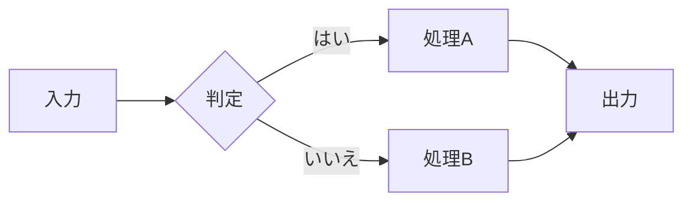
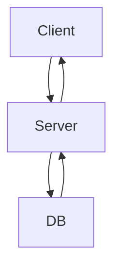

# テキスト系機能

## 段落テスト

これは通常の段落テキストです。

複数の段落を含むスライドも正しく処理されます。

## 順序なしリスト

- 第1レベルのアイテム
- 第1レベルのアイテム2
  - 第2レベル（ネスト）
  - 第2レベル（ネスト）2
    - 第3レベル（深いネスト）

## 順序付きリスト

1. 最初のステップ
2. 二番目のステップ
3. 三番目のステップ

## テーブル

| 言語 | 型付け | パラダイム |
|------|--------|------------|
| Python | 動的 | マルチパラダイム |
| Rust | 静的 | システム |
| Haskell | 静的 | 関数型 |

## コードブロック

```python
def fibonacci(n: int) -> int:
    if n <= 1:
        return n
    return fibonacci(n - 1) + fibonacci(n - 2)
```

# 数式

## インライン数式

円の面積は $A = \pi r^2$ で、
円周は $C = 2\pi r$ で表されます。

## ブロック数式（ディスプレイ数式）

二次方程式の解の公式：

$$x = \frac{-b \pm \sqrt{b^2 - 4ac}}{2a}$$

## 複雑な数式

オイラーの等式：

$$e^{i\pi} + 1 = 0$$

正規分布の確率密度関数：

$$f(x) = \frac{1}{\sigma\sqrt{2\pi}} e^{-\frac{(x-\mu)^2}{2\sigma^2}}$$

# Mermaid図

## フローチャート（標準記法）



## シーケンス図



## Quartoネイティブ記法

```{mermaid}
flowchart LR
    X[スタート] --> Y[処理] --> Z[エンド]
```

## Quartoコードブロック記法

```{python}
import math
print(math.pi)
```

# アニメーション・レイアウト

## インクリメンタルリスト

::: {.incremental}
- まず最初に表示
- 次にこれが表示
- 最後にこれが表示
:::

## 非インクリメンタルリスト

::: {.nonincremental}
- 一括表示アイテム1
- 一括表示アイテム2
- 一括表示アイテム3
:::

## 2カラムレイアウト

:::: {.columns}
::: {.column}
**左カラム**

- 左の項目1
- 左の項目2
- 左の項目3
:::
::: {.column}
**右カラム**

- 右の項目1
- 右の項目2
- 右の項目3
:::
::::

## スピーカーノート付きスライド

このスライドには発表者向けのノートが埋め込まれています。

::: {.notes}
これはスピーカーノートです。発表者ビューでのみ表示されます。
「2カラムレイアウト」について補足説明をここに記入します。
:::

---

水平区切り線（---）によって生成されたタイトルなしスライドです。

# まとめ

## 全機能確認完了

本デモで確認した機能一覧：

- テキスト（段落・リスト・テーブル・コード）
- 数式（インライン・ブロック）
- Mermaid図（標準・Quartoネイティブ記法）
- アニメーション（インクリメンタル・非インクリメンタル）
- 2カラムレイアウト
- スピーカーノート
- Blank スライド（水平区切り線）
