# テキスト系機能

## 段落テスト

これは通常の段落テキストです。

複数の段落を含むスライドも正しく処理されます。

## 順序なしリスト

- 第1レベルのアイテム
- 第1レベルのアイテム2
  - 第2レベル（ネスト）
  - 第2レベル（ネスト）2
    - 第3レベル（深いネスト）

## 順序付きリスト

1. 最初のステップ
2. 二番目のステップ
3. 三番目のステップ

## テーブル

| 言語 | 型付け | パラダイム |
|------|--------|------------|
| Python | 動的 | マルチパラダイム |
| Rust | 静的 | システム |
| Haskell | 静的 | 関数型 |

## コードブロック

```python
def fibonacci(n: int) -> int:
    if n <= 1:
        return n
    return fibonacci(n - 1) + fibonacci(n - 2)
```

# 数式

## インライン数式

円の面積は $A = \pi r^2$ で、
円周は $C = 2\pi r$ で表されます。

## ブロック数式（ディスプレイ数式）

二次方程式の解の公式：

$$x = \frac{-b \pm \sqrt{b^2 - 4ac}}{2a}$$

## 複雑な数式

オイラーの等式：

$$e^{i\pi} + 1 = 0$$

正規分布の確率密度関数：

$$f(x) = \frac{1}{\sigma\sqrt{2\pi}} e^{-\frac{(x-\mu)^2}{2\sigma^2}}$$

# Mermaid図

## 1. フローチャート（Flowchart）— ノード形状デモ


```mermaid
flowchart LR
    A[矩形] --> B(丸角)
    B --> C([スタジアム])
    C --> D[[サブルーチン]]
    D --> E[(シリンダー)]
    E --> F((円))
    F --> G>非対称]
    G --> H{ひし形}
    H --> I{{六角形}}
    I --> J[/右傾斜/]
    J --> K[\左傾斜\]
    K --> L[/台形\]
    L --> M[\逆台形/]
    M --> N(((二重円)))
```

## 1b. フローチャート— 枝分かれ構造デモ

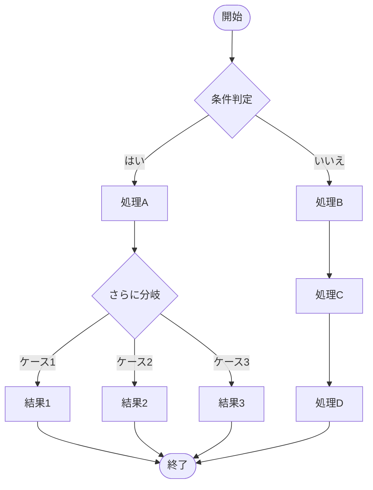
```mermaid
flowchart TD
    A([開始]) --> B{条件判定}
    B -->|はい| C[処理A]
    B -->|いいえ| D[処理B]
    C --> E{さらに分岐}
    D --> F[処理C]
    E -->|ケース1| G[結果1]
    E -->|ケース2| H[結果2]
    E -->|ケース3| I[結果3]
    F --> J[処理D]
    G --> K([終了])
    H --> K
    I --> K
    J --> K
```

## 1c. フローチャート— リンク種別・ラベルデモ

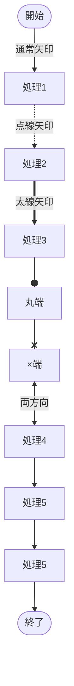
```mermaid
flowchart TD
    A([開始]) -->|通常矢印| B[処理1]
    B -.->|点線矢印| C[処理2]
    C ==>|太線矢印| D[処理3]
    D --o E[丸端]
    E --x F[×端]
    F <-->|両方向| G[処理4]
    G --> H[処理5]
    H --> I[処理5]
    I --> J([終了])
```

## 2a. シーケンス図 - 基本（autonumber・activate・Note）

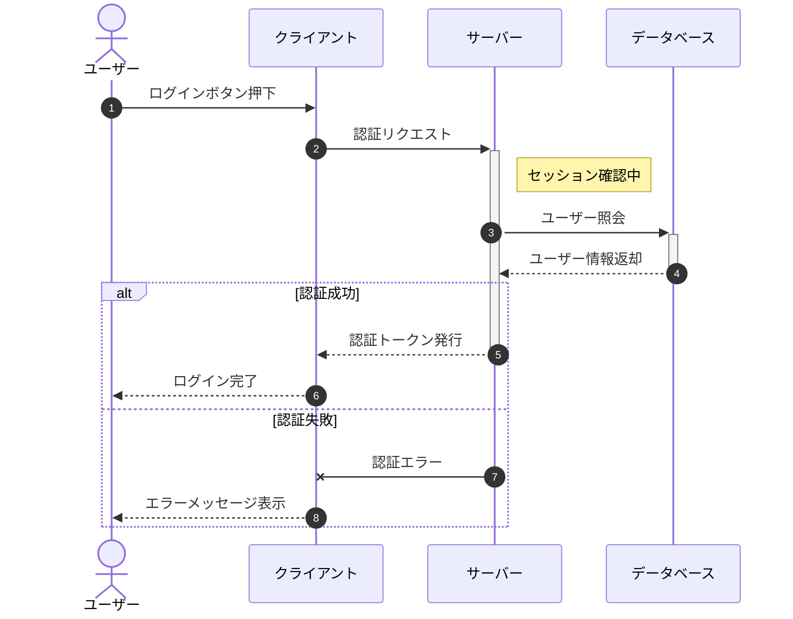
```mermaid
sequenceDiagram
    autonumber
    actor U as ユーザー
    participant C as クライアント
    participant S as サーバー
    participant D as データベース

    U->>C: ログインボタン押下
    C->>+S: 認証リクエスト
    Note right of S: セッション確認中
    S->>+D: ユーザー照会
    D-->>-S: ユーザー情報返却
    alt 認証成功
        S-->>-C: 認証トークン発行
        C-->>U: ログイン完了
    else 認証失敗
        S-xC: 認証エラー
        C-->>U: エラーメッセージ表示
    end
```

## 2b. シーケンス図 - フレーム（loop・par・rect背景）

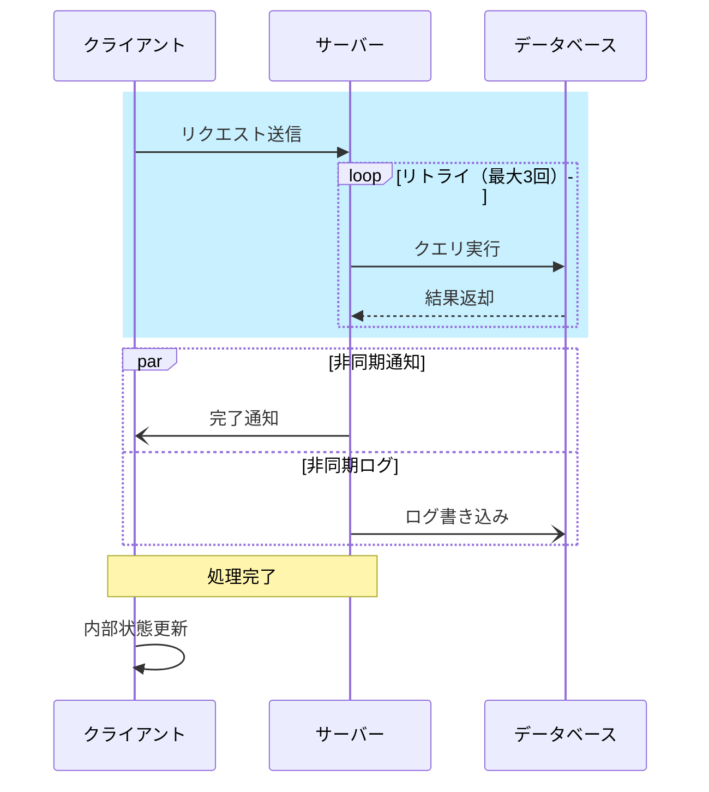
```mermaid
sequenceDiagram
    participant A as クライアント
    participant B as サーバー
    participant C as データベース

    rect rgb(200, 240, 255)
        A->>B: リクエスト送信
        loop リトライ（最大3回）
            B->>C: クエリ実行
            C-->>B: 結果返却
        end
    end
    par 非同期通知
        B-)A: 完了通知
    and 非同期ログ
        B-)C: ログ書き込み
    end
    Note over A,B: 処理完了
    A->>A: 内部状態更新
```

## 3. ガントチャート（Gantt Diagram）— 全タグ・after参照デモ

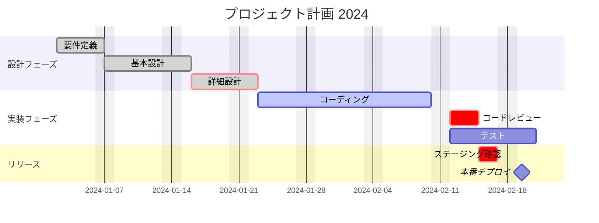
```mermaid
gantt
    title プロジェクト計画 2024
    dateFormat YYYY-MM-DD
    excludes weekends
    section 設計フェーズ
        要件定義      :done, des1, 2024-01-02, 2024-01-07
        基本設計      :done, des2, after des1, 7d
        詳細設計      :done, crit, des3, after des2, 5d
    section 実装フェーズ
        コーディング  :active, dev1, after des3, 14d
        コードレビュー :crit, rev1, after dev1, 3d
        テスト        :dev2, after dev1, 7d
    section リリース
        ステージング確認 :crit, stg1, after rev1, 2d
        本番デプロイ  :milestone, 2024-02-19, 1d
```

## 4. クラス図（Class Diagram）- 全接続タイプ

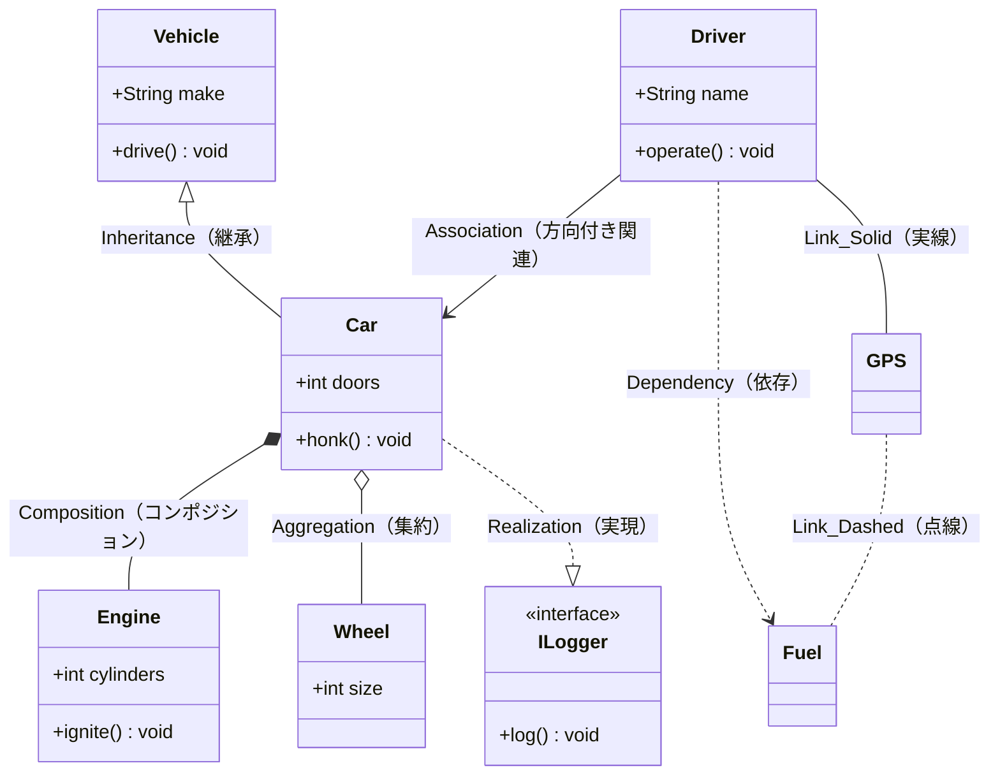
```mermaid
classDiagram
    class Vehicle {
        +String make
        +drive() void
    }
    class Car {
        +int doors
        +honk() void
    }
    class Engine {
        +int cylinders
        +ignite() void
    }
    class Wheel {
        +int size
    }
    class Driver {
        +String name
        +operate() void
    }
    class ILogger {
        <<interface>>
        +log() void
    }
    class Fuel
    class GPS

    Vehicle <|-- Car : Inheritance（継承）
    Car *-- Engine : Composition（コンポジション）
    Car o-- Wheel : Aggregation（集約）
    Driver --> Car : Association（方向付き関連）
    Driver -- GPS : Link_Solid（実線）
    Driver ..> Fuel : Dependency（依存）
    Car ..|> ILogger : Realization（実現）
    GPS .. Fuel : Link_Dashed（点線）
```

## 5a. 状態図（State Diagram） - 通常状態・開始/終了・遷移ラベルのデモ

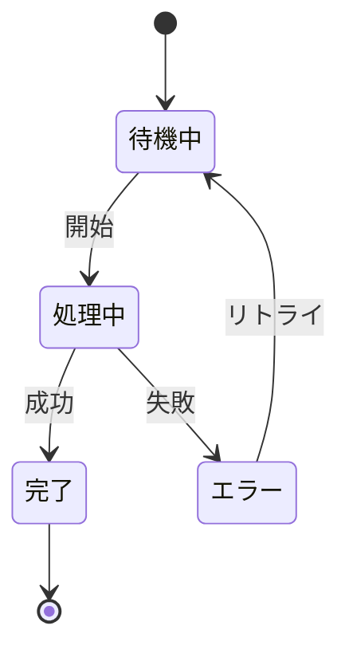
```mermaid
stateDiagram-v2
    [*] --> 待機中
    待機中 --> 処理中 : 開始
    処理中 --> 完了 : 成功
    処理中 --> エラー : 失敗
    エラー --> 待機中 : リトライ
    完了 --> [*]
```

## 5b. 状態図 - 並行（並列）・ノート・LR方向

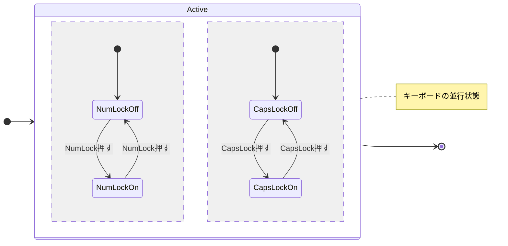
```mermaid
stateDiagram-v2
    direction LR
    [*] --> Active
    state Active {
        [*] --> NumLockOff
        NumLockOff --> NumLockOn : NumLock押す
        NumLockOn --> NumLockOff : NumLock押す
        --
        [*] --> CapsLockOff
        CapsLockOff --> CapsLockOn : CapsLock押す
        CapsLockOn --> CapsLockOff : CapsLock押す
    }
    note right of Active : キーボードの並行状態
    Active --> [*]
```

## 5c. 状態図 - 分岐（choice）・複合状態

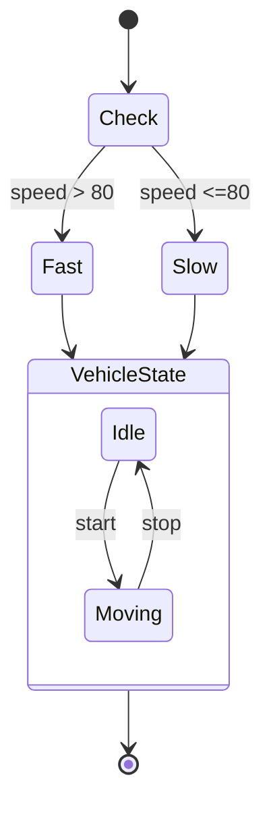
```mermaid
stateDiagram-v2
    [*] --> Check
    Check --> Fast : speed > 80
    Check --> Slow : speed <=80
    state VehicleState {
        Idle --> Moving : start
        Moving --> Idle : stop
    }
    Fast --> VehicleState
    Slow --> VehicleState
    VehicleState --> [*]
```

## 6. ER図（Entity Relationship Diagram）

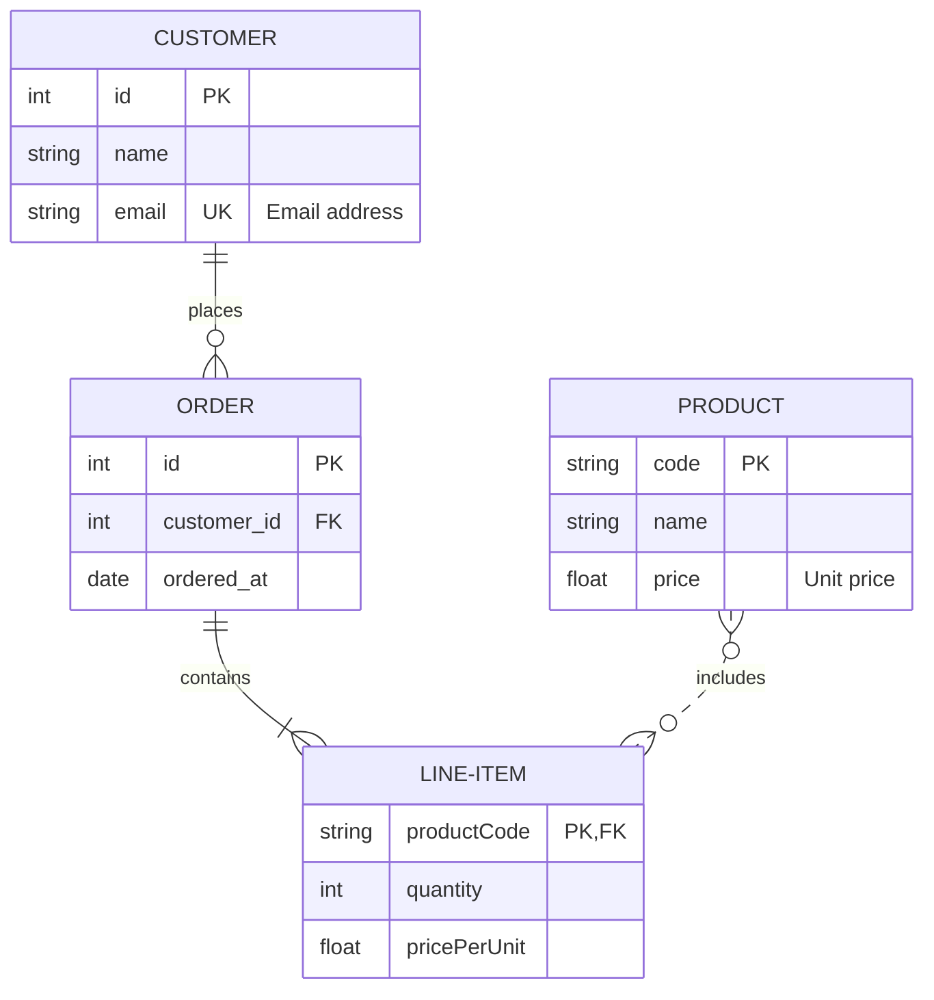
```mermaid
erDiagram
    CUSTOMER ||--o{ ORDER : places
    ORDER ||--|{ LINE-ITEM : contains
    PRODUCT }o..o{ LINE-ITEM : includes
    CUSTOMER {
        int id PK
        string name
        string email UK "Email address"
    }
    ORDER {
        int id PK
        int customer_id FK
        date ordered_at
    }
    LINE-ITEM {
        string productCode PK, FK
        int quantity
        float pricePerUnit
    }
    PRODUCT {
        string code PK
        string name
        float price "Unit price"
    }
```

## 7. ユーザージャーニー図（User Journey）

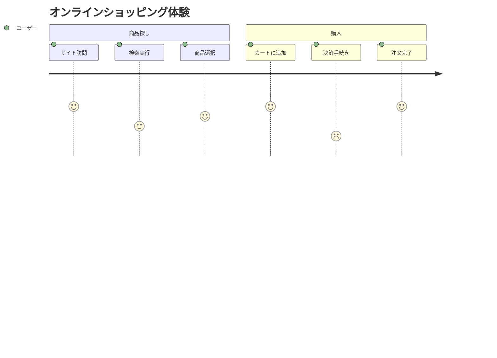
```mermaid
journey
    title オンラインショッピング体験
    section 商品探し
        サイト訪問    : 5: ユーザー
        検索実行      : 3: ユーザー
        商品選択      : 4: ユーザー
    section 購入
        カートに追加  : 5: ユーザー
        決済手続き    : 2: ユーザー
        注文完了      : 5: ユーザー
```

## 8a. 円グラフ（Pie Chart） - パーセント表示（showData なし）

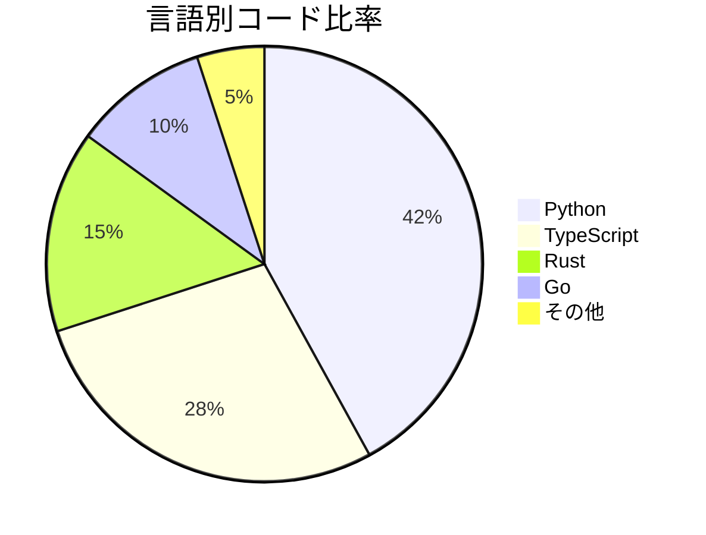
```mermaid
pie title 言語別コード比率
    "Python" : 42
    "TypeScript" : 28
    "Rust" : 15
    "Go" : 10
    "その他" : 5
```

## 8b. 円グラフ（Pie Chart） - パーセント + 実数値表示（showData あり）:

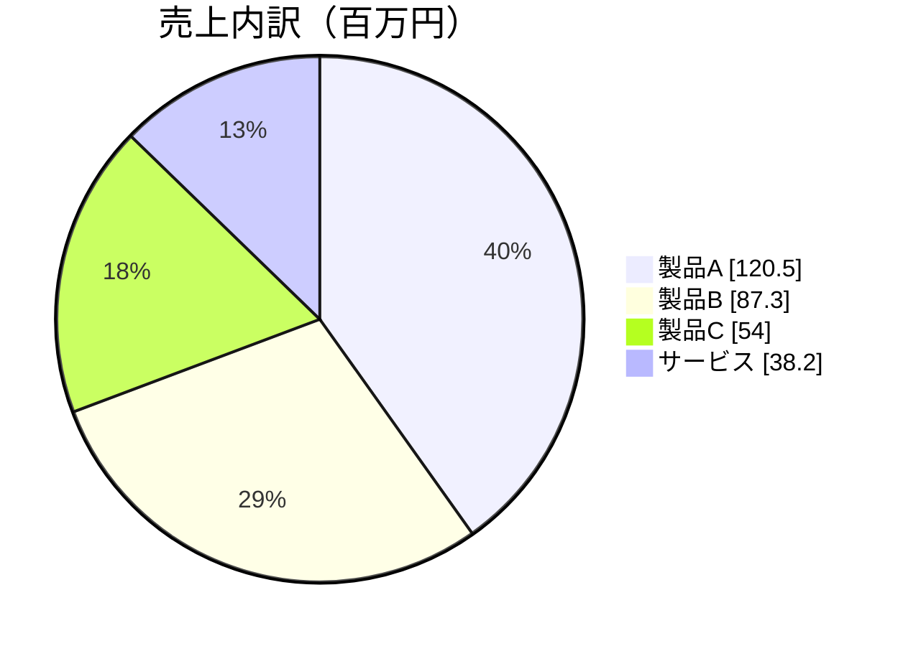
```mermaid
pie showData title 売上内訳（百万円）
    "製品A" : 120.5
    "製品B" : 87.3
    "製品C" : 54.0
    "サービス" : 38.2
```

## 9. 象限チャート（Quadrant Chart）

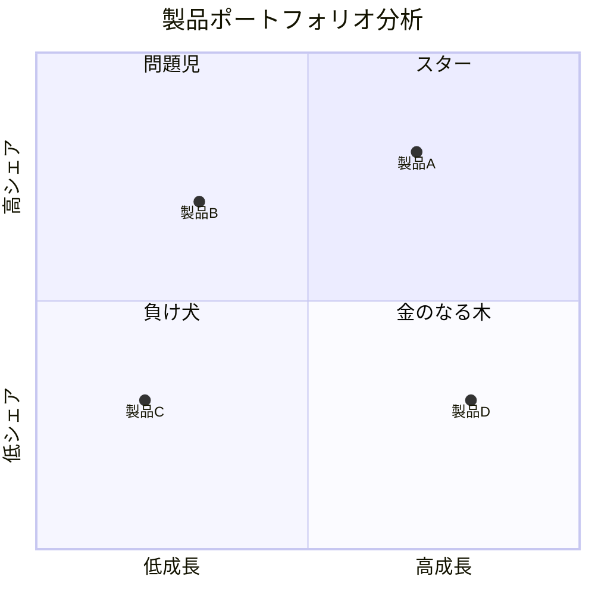
```mermaid
quadrantChart
    title 製品ポートフォリオ分析
    x-axis 低成長 --> 高成長
    y-axis 低シェア --> 高シェア
    quadrant-1 スター
    quadrant-2 問題児
    quadrant-3 負け犬
    quadrant-4 金のなる木
    製品A: [0.7, 0.8]
    製品B: [0.3, 0.7]
    製品C: [0.2, 0.3]
    製品D: [0.8, 0.3]
```

## 10. 要件図（Requirement Diagram）

```mermaid
requirementDiagram
    requirement test_req {
        id: 1
        text: システムは99.9%の可用性を持つこと
        risk: high
        verifymethod: test
    }
    functionalRequirement login_req {
        id: 2
        text: ユーザーはログインできること
        risk: medium
        verifymethod: inspection
    }
    test_req - traces -> login_req
```

## 11a. Gitグラフ — 基本構造（LR方向）

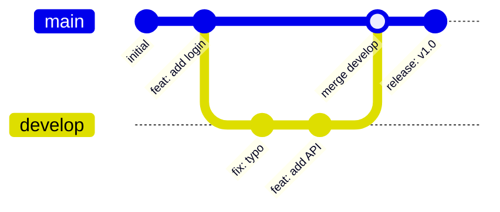
```mermaid
gitGraph
    commit id: "initial"
    commit id: "feat: add login"
    branch develop
    checkout develop
    commit id: "fix: typo"
    commit id: "feat: add API"
    checkout main
    merge develop id: "merge develop"
    commit id: "release: v1.0"
```

## 11b. Gitグラフ — コミットタイプ全種（NORMAL/REVERSE/HIGHLIGHT）とタグ

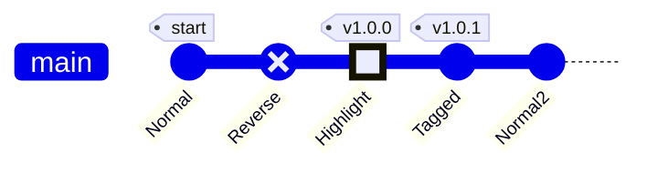
```mermaid
gitGraph
    commit id: "Normal" tag: "start"
    commit id: "Reverse" type: REVERSE
    commit id: "Highlight" type: HIGHLIGHT tag: "v1.0.0"
    commit id: "Tagged" tag: "v1.0.1"
    commit id: "Normal2"
```

## 11c. Gitグラフ — 複数ブランチ・マージ・チェリーピック

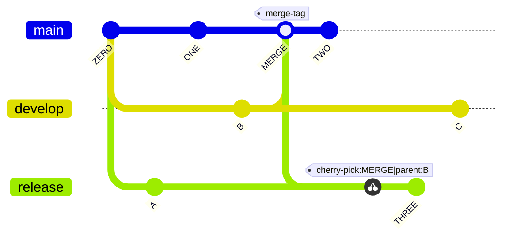
```mermaid
gitGraph
    commit id: "ZERO"
    branch develop
    branch release
    commit id: "A"
    checkout main
    commit id: "ONE"
    checkout develop
    commit id: "B"
    checkout main
    merge develop id: "MERGE" tag: "merge-tag"
    commit id: "TWO"
    checkout release
    cherry-pick id: "MERGE" parent: "B"
    commit id: "THREE"
    checkout develop
    commit id: "C"
```

## 11d. Gitグラフ — Git Flowモデル（hotfix/feature/release）

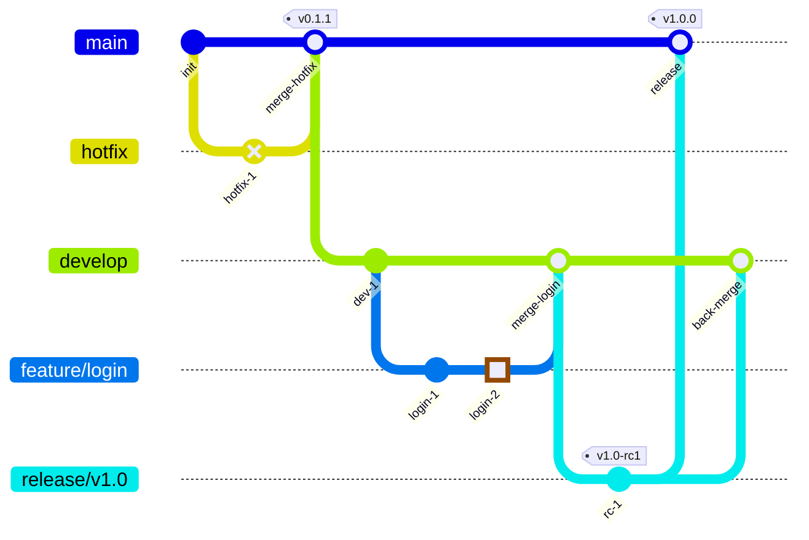
```mermaid
gitGraph
    commit id: "init"
    branch hotfix
    checkout hotfix
    commit id: "hotfix-1" type: REVERSE
    checkout main
    merge hotfix id: "merge-hotfix" tag: "v0.1.1"
    branch develop
    checkout develop
    commit id: "dev-1"
    branch feature/login
    checkout feature/login
    commit id: "login-1"
    commit id: "login-2" type: HIGHLIGHT
    checkout develop
    merge feature/login id: "merge-login"
    branch release/v1.0
    checkout release/v1.0
    commit id: "rc-1" tag: "v1.0-rc1"
    checkout main
    merge release/v1.0 id: "release" tag: "v1.0.0"
    checkout develop
    merge release/v1.0 id: "back-merge"
```

## 11e. Gitグラフ — TB方向（上→下）とbranch order指定

```mermaid
gitGraph TB:
    commit id: "start"
    branch test1 order: 3
    branch test2 order: 2
    branch test3 order: 1
    checkout test3
    commit id: "t3-1"
    checkout test2
    commit id: "t2-1"
    checkout test1
    commit id: "t1-1"
    checkout main
    commit id: "main-1"
    merge test3 id: "mT3" tag: "merged"
```

## 11f. Gitグラフ — BT方向（下→上）とメッセージ付きコミット

```mermaid
gitGraph BT:
    commit id: "v1" msg: "バージョン1リリース" tag: "v1.0"
    branch feature
    checkout feature
    commit id: "f1" msg: "フィーチャー開発" type: HIGHLIGHT
    commit id: "f2" msg: "テスト追加"
    checkout main
    merge feature id: "merge-f" tag: "v2.0"
    commit id: "v2" msg: "バージョン2リリース" type: NORMAL tag: "v2.0.1"
```

## 12. マインドマップ（Mindmap）

```mermaid
mindmap
    root((プログラミング言語))
        スクリプト系
            ((Python))
            ((Ruby))
            ((JavaScript))
        コンパイル系[静的型付け]
            {{Rust}}
            {{Go}}
            (Java)
        関数型
            ))Haskell((
            ))Erlang((
        Web
            [HTML]
            [CSS]
            (TypeScript)
        )クエリ言語(
            [SQL]
            [GraphQL]
```

## 13a. タイムライン — 基本（section なし・複数イベント）

```mermaid
timeline
    title History of Social Media Platform
    2002 : LinkedIn
    2004 : Facebook
         : Google
    2005 : YouTube
    2006 : Twitter
    2007 : Tumblr
    2008 : Instagram
    2010 : Pinterest
```

## 13b. タイムライン — section グループ化（産業革命）

```mermaid
timeline
    title Timeline of Industrial Revolution
    section 17th-20th century
        Industry 1.0 : Machinery, Water power, Steam power
        Industry 2.0 : Electricity, Internal combustion engine, Mass production
        Industry 3.0 : Electronics, Computers, Automation
    section 21st century
        Industry 4.0 : Internet, Robotics, Internet of Things
        Industry 5.0 : Artificial intelligence, Big data, 3D printing
```

## 13c. タイムライン — テキスト折り返し・<br>強制改行

```mermaid
timeline
    title England's History Timeline
    section Stone Age
      7600 BC : Britain's oldest known house was built in Orkney, Scotland
      6000 BC : Sea levels rise and Britain becomes an island.<br> The people who live here are hunter-gatherers.
    section Bronze Age
      2300 BC : People arrive from Europe and settle in Britain.<br>They bring farming and metalworking.
              : New styles of pottery and ways of burying the dead appear.
      2200 BC : The last major building works are completed at Stonehenge.<br> People now bury their dead in stone circles.
```

## 13d. タイムライン — 同行複数イベント・継続行

```mermaid
timeline
    title MermaidChart 2023 Timeline
    section 2023 Q1 <br> Release Personal Tier
      Bullet 1 : sub-point 1a : sub-point 1b
               : sub-point 1c
      Bullet 2 : sub-point 2a : sub-point 2b
    section 2023 Q2 <br> Release XYZ Tier
      Bullet 3 : sub-point 3a : sub-point 3b
               : sub-point 3c
      Bullet 4 : sub-point 4a : sub-point 4b
```

## 13e. タイムライン — 日本語・ソフトウェア開発史

```mermaid
timeline
    title ソフトウェア開発史
    section 黎明期
        1950年代 : アセンブリ言語 : Fortran誕生
        1960年代 : COBOL : BASIC : 構造化プログラミング
    section 普及期
        1970年代 : C言語 : Unix開発
        1980年代 : C++ : Macintosh : PC普及
    section インターネット時代
        1990年代 : Java : World Wide Web : オープンソース運動
        2000年代 : Python普及 : Agile開発 : SNS台頭
    section クラウド・AI時代
        2010年代 : クラウドコンピューティング : スマートフォン全盛
        2020年代 : AI・機械学習 : 大規模言語モデル
```

## 13f. タイムライン — section なし・カラーサイクル確認

```mermaid
timeline
    title プログラミング言語の歴史（カラーサイクルデモ）
    1957 : Fortran
    1959 : COBOL
    1964 : BASIC
    1972 : C言語
    1983 : C++
    1991 : Python
    1995 : Java : JavaScript : Ruby
    2003 : Scala
    2009 : Go
    2012 : TypeScript
    2015 : Rust
    2022 : Carbon
```

## 14. Quartoネイティブ記法

```{mermaid}
flowchart LR
    X[スタート] --> Y[処理] --> Z[エンド]
```

## Quartoコードブロック記法

```{python}
import math
print(math.pi)
```

# アニメーション・レイアウト

## インクリメンタルリスト

::: {.incremental}
- まず最初に表示
- 次にこれが表示
- 最後にこれが表示
:::

## 非インクリメンタルリスト

::: {.nonincremental}
- 一括表示アイテム1
- 一括表示アイテム2
- 一括表示アイテム3
:::

## 2カラムレイアウト

:::: {.columns}
::: {.column}
**左カラム**

- 左の項目1
- 左の項目2
- 左の項目3
:::
::: {.column}
**右カラム**

- 右の項目1
- 右の項目2
- 右の項目3
:::
::::

## スピーカーノート付きスライド

このスライドには発表者向けのノートが埋め込まれています。

::: {.notes}
これはスピーカーノートです。発表者ビューでのみ表示されます。
「2カラムレイアウト」について補足説明をここに記入します。
:::

---

水平区切り線（---）によって生成されたタイトルなしスライドです。

# まとめ

## 全機能確認完了

本デモで確認した機能一覧：

- テキスト（段落・リスト・テーブル・コード）
- 数式（インライン・ブロック）
- Mermaid図（全22種類+）
  - Flowchart / Sequence / Gantt / Class / State
  - ER / User Journey / Pie / Quadrant / Requirement
  - **Git Graph（a-f: 6バリエーション）** / Mindmap / Timeline / ZenUML / Sankey
  - XY Chart / Block / Packet / Kanban / Architecture / C4
  - Quartoネイティブ記法
- アニメーション（インクリメンタル・非インクリメンタル）
- 2カラムレイアウト
- スピーカーノート
- Blank スライド（水平区切り線）
