# テキスト系機能

## 段落テスト

これは通常の段落テキストです。

複数の段落を含むスライドも正しく処理されます。

## 順序なしリスト

- 第1レベルのアイテム
- 第1レベルのアイテム2
  - 第2レベル（ネスト）
  - 第2レベル（ネスト）2
    - 第3レベル（深いネスト）

## 順序付きリスト

1. 最初のステップ
2. 二番目のステップ
3. 三番目のステップ

## テーブル

| 言語 | 型付け | パラダイム |
|------|--------|------------|
| Python | 動的 | マルチパラダイム |
| Rust | 静的 | システム |
| Haskell | 静的 | 関数型 |

## コードブロック

```python
def fibonacci(n: int) -> int:
    if n <= 1:
        return n
    return fibonacci(n - 1) + fibonacci(n - 2)
```

# 数式

## インライン数式

円の面積は $A = \pi r^2$ で、
円周は $C = 2\pi r$ で表されます。

## ブロック数式（ディスプレイ数式）

二次方程式の解の公式：

$$x = \frac{-b \pm \sqrt{b^2 - 4ac}}{2a}$$

## 複雑な数式

オイラーの等式：

$$e^{i\pi} + 1 = 0$$

正規分布の確率密度関数：

$$f(x) = \frac{1}{\sigma\sqrt{2\pi}} e^{-\frac{(x-\mu)^2}{2\sigma^2}}$$

# Mermaid図

## 1. フローチャート（Flowchart）— ノード形状デモ

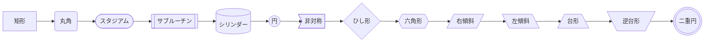

## 1b. フローチャート— リンク種別・ラベルデモ

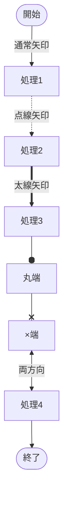

## 2. シーケンス図（Sequence Diagram）

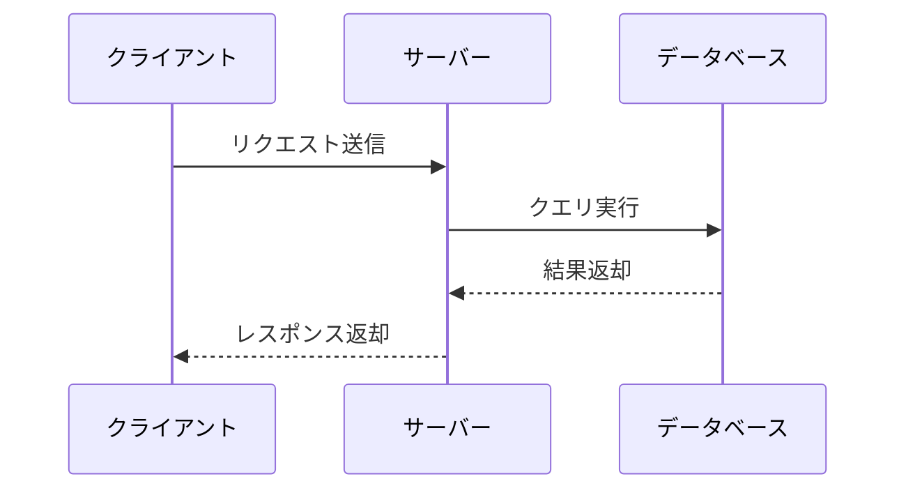

## 3. ガントチャート（Gantt Diagram）

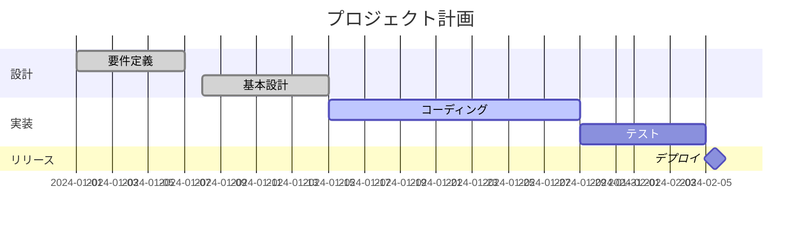

## 4. クラス図（Class Diagram）- 全接続タイプ

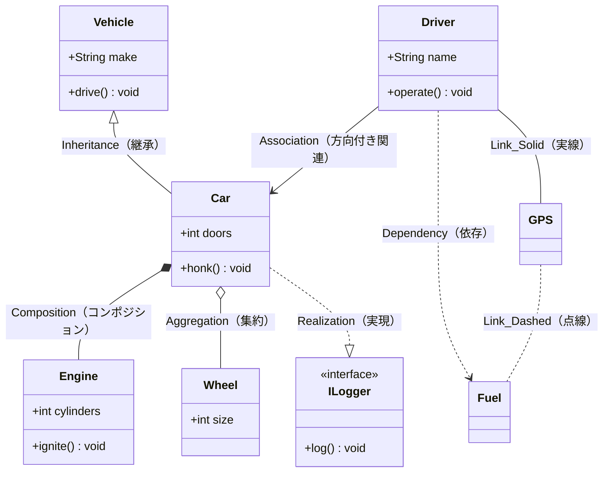

## 5. 状態図（State Diagram）

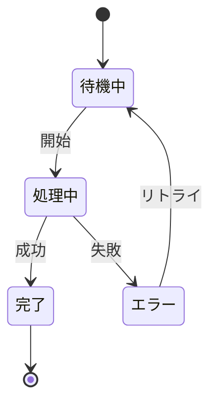

## 6. ER図（Entity Relationship Diagram）

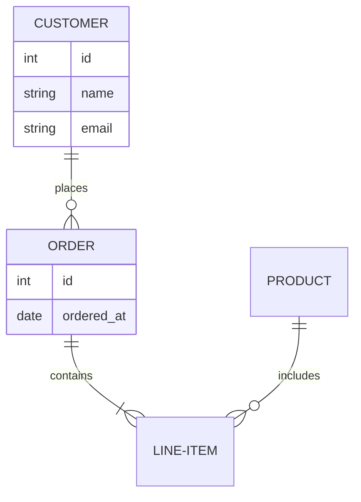

## 7. ユーザージャーニー図（User Journey）

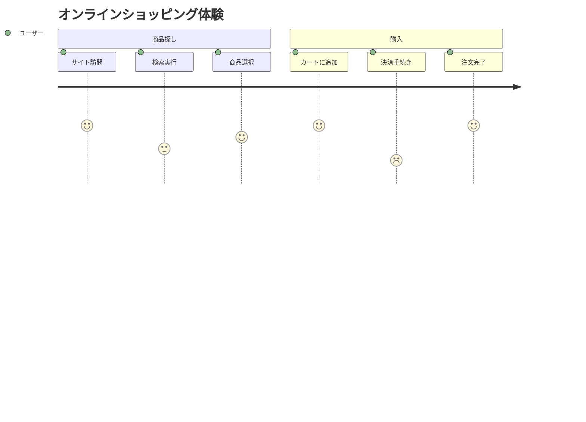

## 8. 円グラフ（Pie Chart）

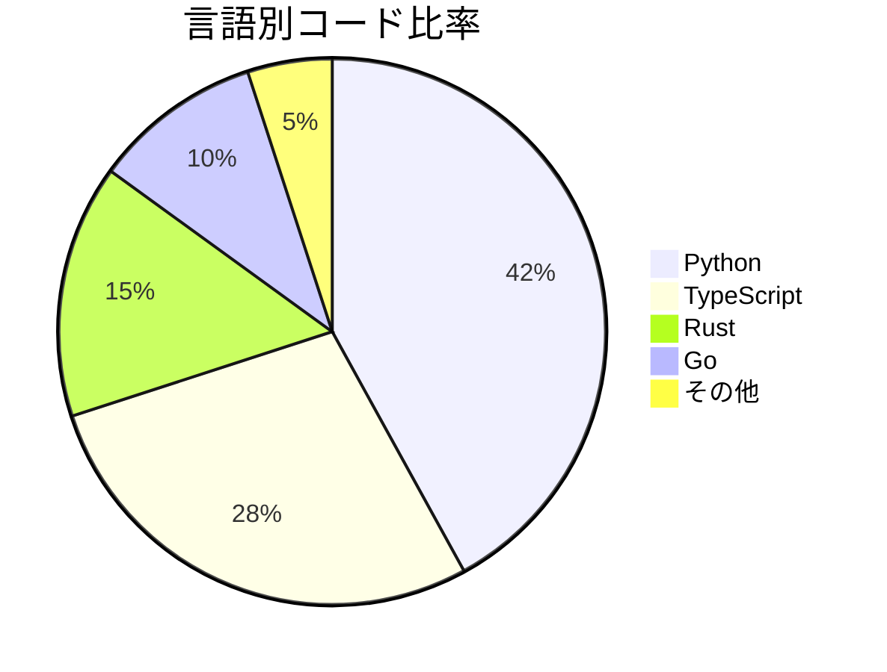

## 9. 象限チャート（Quadrant Chart）

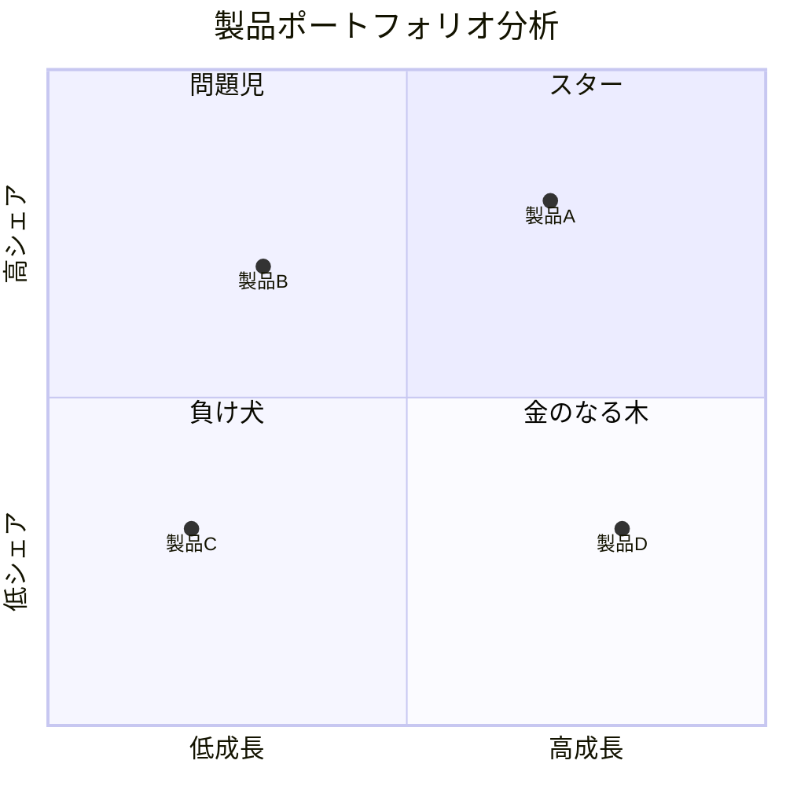

## 10. 要件図（Requirement Diagram）

```mermaid
requirementDiagram
    requirement test_req {
        id: 1
        text: システムは99.9%の可用性を持つこと
        risk: high
        verifymethod: test
    }
    functionalRequirement login_req {
        id: 2
        text: ユーザーはログインできること
        risk: medium
        verifymethod: inspection
    }
    test_req - traces -> login_req
```

## 11. Gitグラフ（Git Graph）

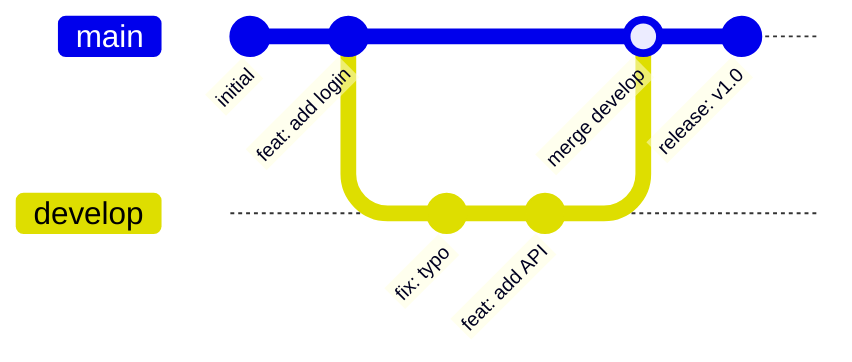

## 12. マインドマップ（Mindmap）

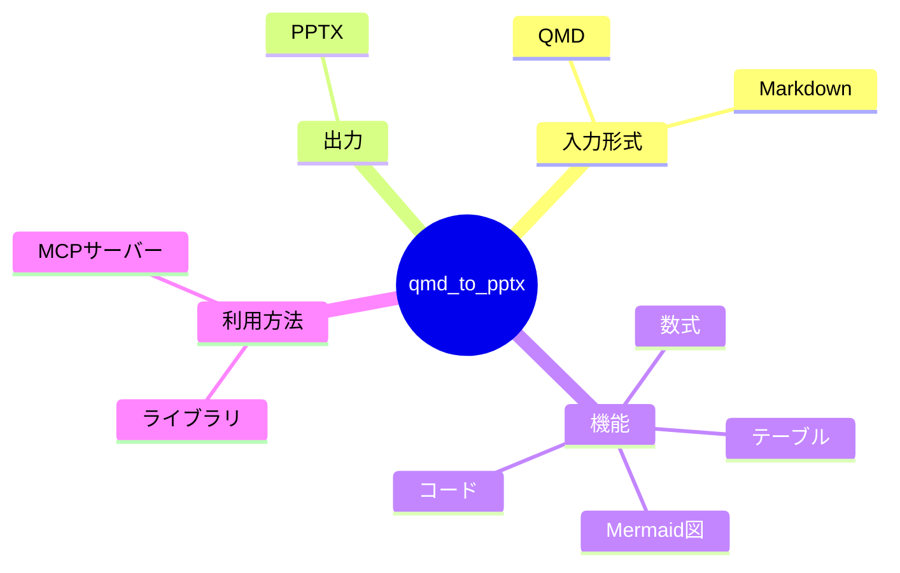

## 13. タイムライン（Timeline）

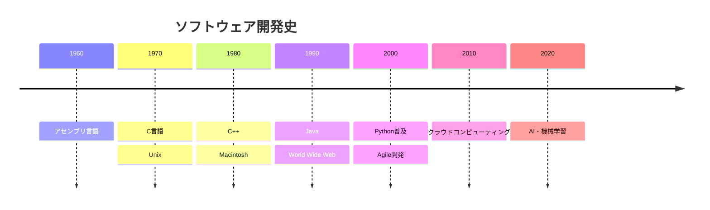

## 14. ZenUML

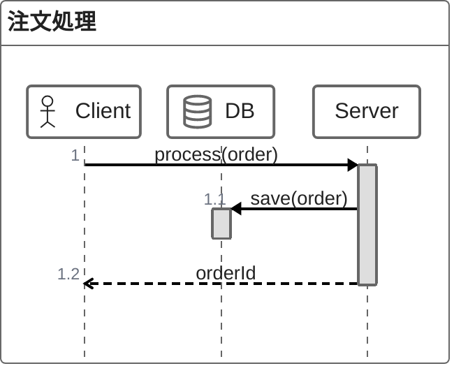

## 15. サンキー図（Sankey Diagram）

```mermaid
sankey-beta
    エネルギー源,電力,60
    エネルギー源,熱,40
    電力,家庭用,25
    電力,産業用,35
    熱,暖房,30
    熱,給湯,10
```

## 16. XYチャート（XY Chart）

```mermaid
xychart-beta
    title "月別売上推移"
    x-axis [1月, 2月, 3月, 4月, 5月, 6月]
    y-axis "売上（万円）" 0 --> 1000
    bar [400, 500, 650, 720, 850, 900]
    line [400, 500, 650, 720, 850, 900]
```

## 17. ブロック図（Block Diagram）

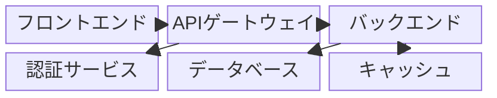

## 18. パケット図（Packet Diagram）

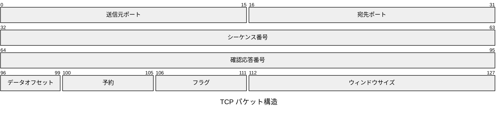

## 19. カンバン（Kanban）

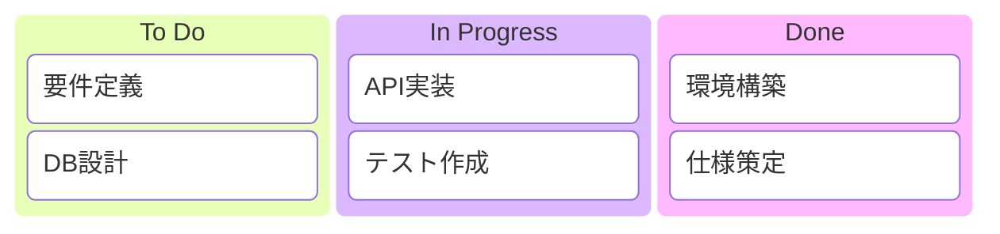

## 20. アーキテクチャ図（Architecture Diagram）

```mermaid
architecture-beta
    group cloud(cloud)[クラウド]
    service web(internet)[Webサーバー] in cloud
    service api(server)[APIサーバー] in cloud
    service db(database)[データベース] in cloud
    service cache(disk)[キャッシュ] in cloud
    web:R --> L:api
    api:R --> L:db
    api:B --> T:cache
```

## 21. C4図（C4 Diagram）

```mermaid
C4Context
    title システムコンテキスト図
    Person(user, "ユーザー", "アプリケーションを利用する人")
    System(app, "Webアプリ", "主要なシステム")
    System_Ext(email, "メールサービス", "通知送信")
    System_Ext(payment, "決済サービス", "支払い処理")
    Rel(user, app, "利用する", "HTTPS")
    Rel(app, email, "送信する", "SMTP")
    Rel(app, payment, "呼び出す", "API")
```

## 22. Quartoネイティブ記法

```{mermaid}
flowchart LR
    X[スタート] --> Y[処理] --> Z[エンド]
```

## Quartoコードブロック記法

```{python}
import math
print(math.pi)
```

# アニメーション・レイアウト

## インクリメンタルリスト

::: {.incremental}
- まず最初に表示
- 次にこれが表示
- 最後にこれが表示
:::

## 非インクリメンタルリスト

::: {.nonincremental}
- 一括表示アイテム1
- 一括表示アイテム2
- 一括表示アイテム3
:::

## 2カラムレイアウト

:::: {.columns}
::: {.column}
**左カラム**

- 左の項目1
- 左の項目2
- 左の項目3
:::
::: {.column}
**右カラム**

- 右の項目1
- 右の項目2
- 右の項目3
:::
::::

## スピーカーノート付きスライド

このスライドには発表者向けのノートが埋め込まれています。

::: {.notes}
これはスピーカーノートです。発表者ビューでのみ表示されます。
「2カラムレイアウト」について補足説明をここに記入します。
:::

---

水平区切り線（---）によって生成されたタイトルなしスライドです。

# まとめ

## 全機能確認完了

本デモで確認した機能一覧：

- テキスト（段落・リスト・テーブル・コード）
- 数式（インライン・ブロック）
- Mermaid図（全22種類）
  - Flowchart / Sequence / Gantt / Class / State
  - ER / User Journey / Pie / Quadrant / Requirement
  - Git Graph / Mindmap / Timeline / ZenUML / Sankey
  - XY Chart / Block / Packet / Kanban / Architecture / C4
  - Quartoネイティブ記法
- アニメーション（インクリメンタル・非インクリメンタル）
- 2カラムレイアウト
- スピーカーノート
- Blank スライド（水平区切り線）
